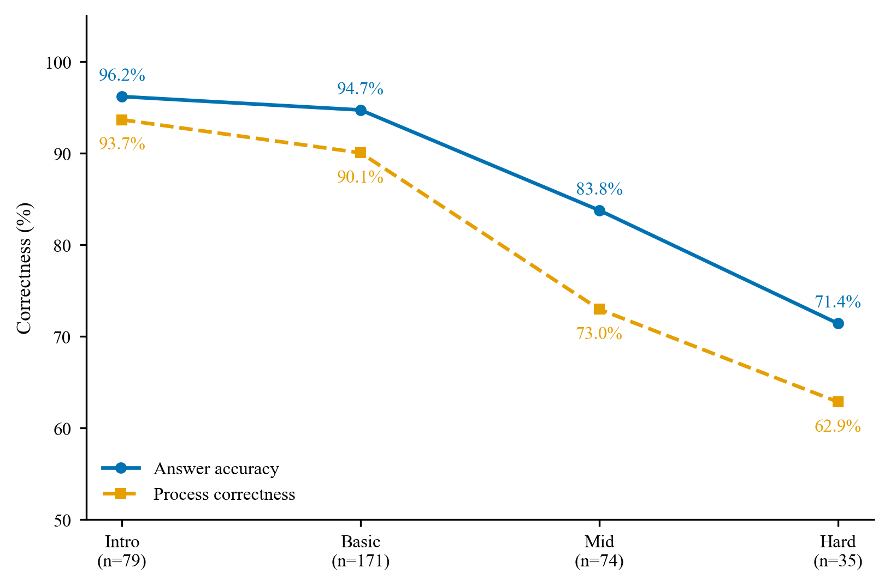
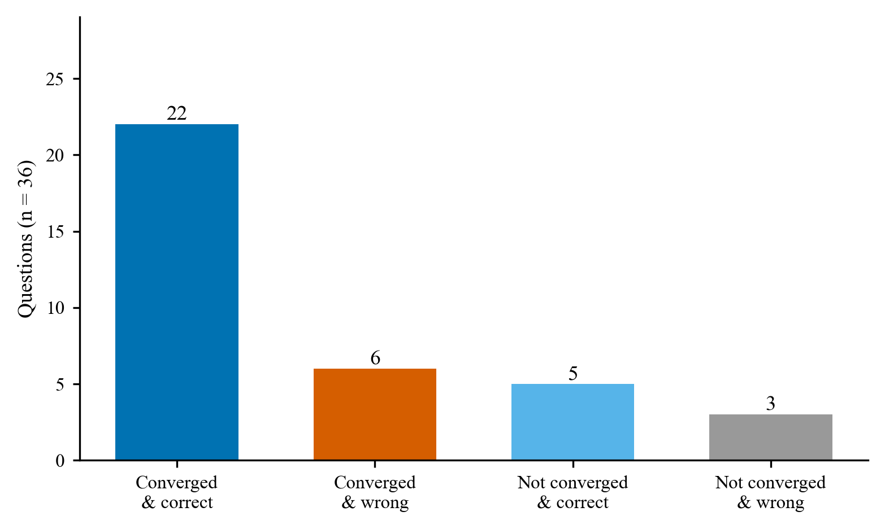
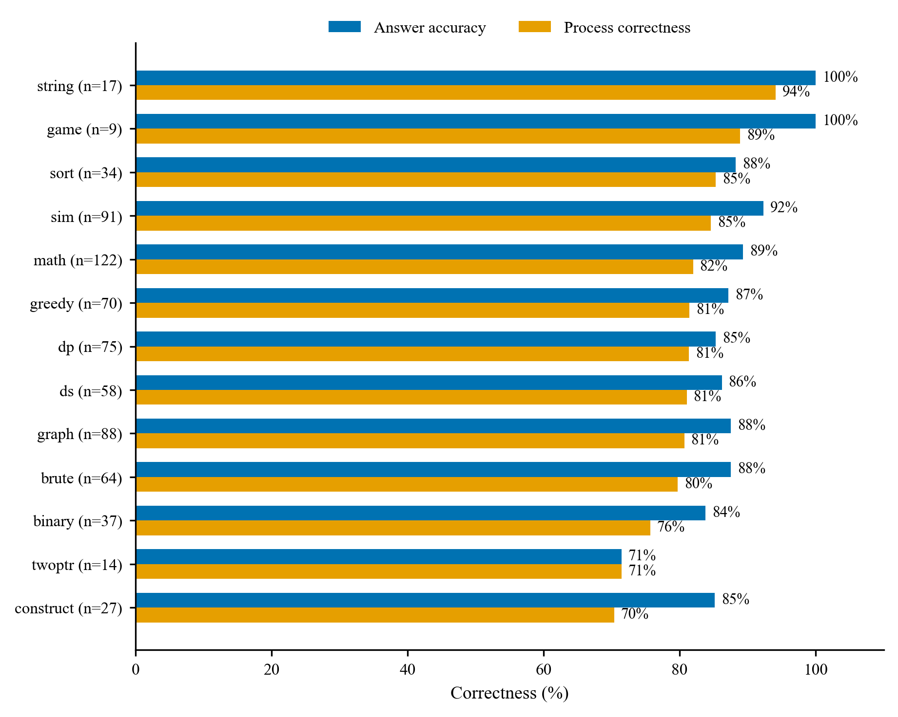

# HY3Coder 分析报告

> 更新时间：2026-09-11 ｜ 数据：`data/outputs/`，评测与修正数据分开存放
>
> 网页版：`reports/REPORT.html`，与本文内容一致，表格与配图排版更适合阅读与打印。

## 交付概览

本报告对应一个可运行的**算法题求解与过程评估系统**，以及基于自建评测集的**全量分析报告**。系统对每题独立求解一次，用沙盒执行结果判定答案，用双视角审查加程序化裁决判定过程，再由 ReAct 闭环把过程缺陷反馈回求解端。下面是交付物与核心结论，先看这一节即可判断完成情况；亮点在正文各章，方法与验证在附录 A–D。

**交付物**

| 交付物 | 位置 |
|---|---|
| 分析报告（正文） | 本文；网页版 `reports/REPORT.html`，表格与配图排版更适合阅读与打印 |
| 求解与评估系统 | `src/rex/`：求解 agent、V1/V2 双视角 verifier 与 ARBITER 仲裁、Python 与 C++ 沙盒、`static_check` 规则校验、ReAct 修正闭环 |
| 自建评测集 | `data/questions/abc_selfbuilt.jsonl`（175 题）、`cf_selfbuilt.jsonl`（184 题），每题含可执行参考解、公开用例与隐藏用例 |
| 评测与验证记录 | `data/outputs/`：正式评测逐题记录、修正闭环逐轮记录、记忆暴露探测、人工抽检回填 |
| 方法文档（4 份） | `reports/` 下的难度分层、过程评估、ReAct 闭环、记忆暴露四篇；全文即附录 A–D |
| 可视化仪表盘 | `src/web/`：FastAPI 后端加单文件 SPA（`static/`）；`.\run.ps1 serve` 后打开 `127.0.0.1:8000`，含评估总览、单题回放、Golden 库、人工抽检、交互式解题、题集浏览器 |
| 演示录像 | `HY3Coder-demo.mp4`（79 秒 / 1920×1080） |
| 复现说明 | `README.md`：环境要求、快速开始、逐项复现命令 |

**核心结论**

| 维度 | 结果 |
|---|---|
| 评测规模 | 359 题（ABC 175 / CF 184），temperature=0，每题一次求解 |
| 答案准确率 | **90.0%**；ABC 93.7% / CF 86.4% |
| 过程正确率 | **84.4%**；ABC 90.3% / CF 78.8%，95% CI [80.3%, 87.8%] |
| 隐蔽缺陷检出 | SILENT_FAILURE **15 题（4.2%）**：答案全对、用例全过，过程仍有致命缺陷 |
| 错误定位准确率 | 答案错样本 29 条全量复核，命中 **96.6%** |
| 误报控制 | 三层复核误报率 **5.3%–10.5%**（19 条被判过程有错，口径见 §6） |
| 修正闭环 | 答案错的 36 题，限 3 轮内 **77.8%** 收敛，最终 27 题答案正确 |
| 能力边界 | 过程正确率随难度单调下降，中等档起显著失守（93.7% → 62.9%） |
| 记忆暴露 | 出处精确命中 6/30（20.0%），未观察到记忆抬高成绩 |

**阅读指引**

- 只看结论：本节 + 第 1 章（总览、记忆暴露、任务要求逐条对照）+ 第 9 章（适用范围与边界）。
- 看亮点：第 3 章 错误类型分布、第 4 章 5 个典型案例（题目、完整求解过程与判定）、第 5 章 修正闭环、第 7 章 15 条 SILENT_FAILURE 清单。
- 核验方法与数据：第 2 章 分层退化、第 6 章 人工抽检、附录 A–D 四份方法文档、`README.md` 复现章节。
- 第 4 章按「判定结论 → 题目全文 → 求解过程 → 判定证据」排列，网页版把题目与过程折成可展开区块，建议在 `reports/REPORT.html` 中读这一章。

## 1. 评估总览

| 指标 | 数值 |
|---|---|
| 评估样本数 | 359 |
| 答案准确率 | 90.0% |
| 过程正确率（仅 fatal 计入过程错） | 84.4% |
| 仅 minor 的记录样本 | 23（主口径计为过程正确） |
| 判定分布 | ANSWER_INCORRECT=8, CORRECT=303, PROCESS_INCORRECT=33, SILENT_FAILURE=15 |
| 沉默失败检出 | 15（4.2%） |
| 过程正确率 95% CI（Wilson） | [80.3%, 87.8%] |


**分平台概览**

| 子集 | 样本 | 答案准确率 | 过程正确率 |
|---|---|---|---|
| ABC 自建 | 175 | 93.7% | 90.3% |
| CF 自建 | 184 | 86.4% | 78.8% |

**稳定性说明**：本章数值全部来自仓库中已固化的 t0 正式评测记录（temperature=0，359 题，每题一次求解），读取同一份记录重算得到的结果逐位一致，不含运行期随机性。为看样本构成对结论的影响，按难度档用两组固定随机种子各重抽 60% 样本，过程正确率分别为 84.1% 与 81.3%，漂移 2.8pp，在 5pp 的判稳阈值以内。再用 20 组种子跑同一检验（`stability_sweep`）：漂移中位数 1.9pp、最大 4.7pp，全部 20 组都在阈值内——指标对"抽到哪一部分题"不敏感。本检验衡量的是**样本构成**的影响；本报告是 temperature=0 的单次基线，指标区间由上面的 Wilson 置信区间与这一检验共同给出。


### 1.1 记忆暴露检测

题集都取自官方原题镜像，成绩里难免掺进记忆的成分，所以只能算能力加记忆的上界。为估计暴露程度，按平台与难度分层抽 30 题，每层 5 题，每题问两个独立的问题：能否说出题目出处，能否讲清标准解法。判定规则见附录 D，原始记录在 `data/outputs/contamination_probe.jsonl`。


| 指标 | 数值 |
|---|---|
| 探测样本 | 30 |
| 自称见过 | 29，96.7%；迎合偏差高，不作暴露证据 |
| 出处精确命中 | 6，20.0%；95% CI [10%, 37%] |
| 命中样本的平台分档 | basic 4 / medium 2 / hard 0 |
| 命中样本 | `A1023`（abc300_c）, `C2001`（cf1a）, `C2002`（cf71a）, `C2008`（cf1730a）, `C2072`（cf719a）, `C2149`（cf568a） |


与正式评测交叉，看记忆是否带来红利：


| 组 | 样本 | t0 答案正确 |
|---|---|---|
| 出处命中组 | 6 | 5（83.3%） |
| 未命中组 | 24 | 22（91.7%） |


模型对官方原题普遍自称熟悉，30 题里有 29 题答见过；但能说准出处的只有 6 题，且全部落在入门到基础的经典题上，比如 Theatre Square、71A、719A、1730A、ABC300C，中等以上难度没有出现背题式的出处记忆。命中出处的 6 题与其余 24 题在正式评测上分别答对 5 题和 22 题，看不出记忆抬高了成绩。`C2149` 是个反例：模型记得它出自 CF 568A，正式评测仍然答错，记忆存在不等于能力存在。局限有三处：训练语料无法实证，行为探测本身有假阴假阳，命中样本又集中在全网烂熟的题上，实际威胁度低。方法见附录 D。


### 1.2 与任务要求的逐条对照


| 任务要求 | 本系统的对应 | 落点 |
|---|---|---|
| 题集要有标准答案、可自动校验、分难度、说明来源 | 每题带可执行的 AC 参考解与测试用例，公开用例和隐藏用例都在，多解题目用 SPJ 判定；难度按统一难度分分层，平台官方档只作采样与对照 | `data/questions/*.jsonl`；分层方法见附录 A；理由见 §1.3 |
| 过程正确性判定、错误定位、错误归类、"答案对但过程不成立"识别 | verdict 四值；findings 带 `step_id`；10 类错误类型；SILENT_FAILURE | 本报告 §3 与 §7；判定方法见附录 B |
| 实现手段：沙盒校验、多视角 Agent 复核 | 沙盒校验：Python 与 C++ 沙盒跑公开与隐藏用例，答案真值以沙盒为准，`static_check` 的规则校验作为补充诊断证据；多视角 Agent 复核：V1 自含性审查与 V2 全局回溯各自给出 verdict 与 findings，再由 ARBITER 总仲裁 | 附录 B；代码 `src/rex/` |
| 答案错样本的定位准确率与答案对样本的误报率 | 答案错的 29 条全量人工复核，定位命中 28 条，96.6%；答案对却被判过程有错的 19 条做三层复核 | 本报告 §6，48 条全部抽检 |
| 分析报告：设计依据、错误分类、典型案例、能力边界 | 本报告 §1 至 §9，附录 A 至 D 为四份方法文档全文 | `reports/REPORT.md` |

答案轴与过程轴分开取证，是这套判定能成立的前提。执行反馈（沙盒跑公开与隐藏用例、与标准答案比对）只用来确定**答案**这一轴；**过程**这一轴的判定要求双视角读推理链后给出逐步定位与证据，prompt 里明确写了"最终答案正确 ≠ 过程正确，不得因答案正确而放行"。两轴最后由 pipeline 的固定规则汇合：答案对且无 fatal → CORRECT，答案对但有 fatal → SILENT_FAILURE，答案错则只可能是过程错或答案错（规则见附录 B、DESIGN §6.4）。第 7 节那 15 条答案正确却被判过程 fatal 的样本，就是过程轴独立于答案轴产出判定的直接证据。

### 1.3 题集来源与构建方式

题集按自建方式构建：来源是 AtCoder ABC 与 Codeforces 的官方赛题，构造链路是抓题面、取平台 AC 提交作参考解、官方样例加人工边界用例，分层依据见附录 A。这与任务对评测样本的要求一致——样本由参与者自行收集或构造，并说明来源、构造方式与覆盖范围，自建链路正好把这几项都落在明面上。

另一个原因是判定方式的匹配。本系统把标准答案定义为可执行参考解加测试用例，答案真值由沙盒执行给出；多解构造题还需要 SPJ 按题目谓词判定。

公开解答集（GSM8K、MATH、MBPP、ProcessBench 这类）多按"答案唯一、可做文本比对"构造：题面配一份参考解答，判对错靠逐行比对，基本不含多解构造题，也不要求每题带可执行参考解与可复现用例。而多解构造题恰恰是过程评估最容易失手的地方——同一份输出可以有多个合法形态，只比答案会把合法解判错，只看最终答案也看不出"答案合法但过程不成立"。自建题集里这类题共 21 道（ABC 6 / CF 15），checker 以 `checker_code` 内联在题目记录里，评测不依赖外部判定装置；隐藏用例则用来挡"恰好通过公开样例"。

代价是缺少与公开基准直接可比的数字。这一点用平台官方 ELO 作外部锚点校验来部分弥补：统一难度分与 ABC 官方 ELO 的 Spearman 相关为 0.706、与 CF 为 0.816（见附录 A）。

### 1.4 应用形态与演示链路

本报告的所有读数由 CLI 批量产出（`run-eval` / `run-refine` / `audit` / `check-answers`，复现命令见附录）；应用侧把这些能力装进一个可运行的界面：FastAPI 后端加单文件 SPA，本地 `.\run.ps1 serve` 后打开 `127.0.0.1:8000`，含评估总览、单题回放、Golden 库、人工抽检、交互式解题、题集浏览器六个视图。


**仪表盘评估总览**（应用形态，非数据图）：顶部为已评估题量、答案准确率、过程正确率与沉默失败检出四项指标，下方依次是分层退化、判定分布、错误类型分布与知识点能力画像。

其中"交互式解题"是按现场演示设计的链路：从题集载入题目（连同该题自带参考解）→ 在服务端沙盒里试运行参考解、逐用例回显输入、期望与实际输出 → Hy3 逐 Step 流式求解（步骤卡片依次出现，当前步正文实时增长）→ 过程评估给出 verdict 与 findings → 会话完整留档并分配新题号，可在单题回放入口按题号回看。侧栏"模型配置"可设提供方、Key、推理强度与温度，页面顶部与求解进度都标出本次调用的模型，便于录屏与复现。演示录像 `HY3Coder-demo.mp4`（79 秒）就是这条链路的完整录制。

交互演示的题目、会话快照与判定记录写在独立文件里（`data/questions/interactive.jsonl`、`data/outputs/interact_sessions.jsonl`、`data/outputs/eval_interactive.jsonl`），与正式评测物理分离，不进任何统计口径。

## 2. 分层退化分析

本章有两条难度轴。统一难度分 `diff_score` 是本报告使用的标准，分层退化分析与后面各章的难度标注都以它为准；平台官方标签只作对照，用来看两个平台各自的原始分级。


### 2.1 统一难度轴


`diff_score` 是统一难度分，由 Hy3 三位专家盲打后仲裁给出，取值 0 到 100，与题目来自哪个平台无关，方法与验证见附录 A。按绝对语义刻度切四档：0–20 入门，20–40 基础套路，40–60 中等，60–100 难到极高难。这里不做样本均分，档位含义在跨数据集时保持稳定。


| 语义档 | diff_score 区间 | 样本 | 答案准确率 | 过程正确率 | 95% CI |
|---|---|---|---|---|---|
| 入门~一眼题 | [0,20) | 79 | 96.2% | 93.7% | [86.0%, 97.3%] |
| 基础~套路 | [20,40) | 171 | 94.7% | 90.1% | [84.7%, 93.7%] |
| 中等 | [40,60) | 74 | 82.4% | 71.6% | [60.5%, 80.6%] |
| 难~极高难 | [60,100) | 35 | 68.6% | 62.9% | [46.3%, 76.8%] |

**临界点**：过程正确率随难度单调下降，从入门~一眼题档的 93.7% 落到难~极高难档的 62.9%。
首次 8pp 以上的显著跌落出现在中等档，即 `diff_score` 到 40 以后，模型的过程能力开始明显失守。

`diff_score` 80 以上的极高档只有 5 题，难档整体也才 35 题，读数被个位数样本支配，因此并入难到极高难一档看，不单独下能力结论；上面的临界点结论也只在入门到中等区间成立。



**Fig. 1** 统一难度分档下答案准确率与过程正确率的变化。难档覆盖 `diff_score` 60 以上共 35 题，其中 80 以上的 5 题并入。过程正确率从中等档开始显著跌落，降到 71.6%，这是高难能力边界的第一条证据。


### 2.2 平台难度轴


按各平台官方难度校正后分 basic、medium、hard 三档，仅作对照。


| 难度 | 样本 | 答案准确率 | 过程正确率 |
|---|---|---|---|
| basic | 68 | 94.1% | 91.2% |
| medium | 165 | 93.9% | 89.1% |
| hard | 126 | 82.5% | 74.6% |

## 3. 错误类型分布

按评估器已报告的 finding 统计：


| 错误类型 | 数量 | 占比 |
|---|---|---|
| 逻辑缺陷 | 30 | 27.0% |
| 实现层失败 | 18 | 16.2% |
| 复杂度不达标 | 14 | 12.6% |
| 概念理解错误 | 13 | 11.7% |
| 计算错误 | 12 | 10.8% |
| 条件遗漏 | 6 | 5.4% |
| 跳步推导 | 5 | 4.5% |
| 边界条件 | 5 | 4.5% |
| 格式不符 | 5 | 4.5% |
| 题意误读 | 3 | 2.7% |


**Fig. 2** 过程错误类型分布，条形末端给出条数与占比。逻辑缺陷与实现层错误合计超过一半，短板主要在实现严谨性与建模正确性。


## 4. 典型案例归因

下面取 5 例，逐题给出题目、HY3 的求解过程与过程评估判定；难度按第 2 章的语义档标注，完整清单见第 7 节。5 例全部是 `SILENT_FAILURE`，也就是答案与用例全通过、过程仍有致命缺陷的类型，正是任务要求识别的"答案对但过程不成立"。网页版 `reports/REPORT.html` 把每题的三块折成可展开区块，长文阅读建议在网页版进行。

| 案例 | 难度 | 判定 | 致命缺陷定位 | 看点 |
|---|---|---|---|---|
| `A1098` abc228_d | 中等 46 | SILENT_FAILURE | 第 2 步 逻辑缺陷、第 4 步 边界条件 | 并查集环形回绕与数组越界，评测用例恰好不覆盖 |
| `A1148` abc368_d | 基础~套路 22 | SILENT_FAILURE | 第 2 步 概念理解错误、逻辑缺陷 | 保留条件断言写错，用例集恰好都含顶点 1 关键点而碰巧通过 |
| `A1164` abc386_d | 中等 50 | SILENT_FAILURE | 第 3 步 复杂度不达标 | 自称 O(M log M)，实际实现是 O(M²) |
| `A1174` abc392_e | 中等 50 | SILENT_FAILURE | 第 4 步 逻辑缺陷 | 构造过程按顺序消耗备用边，边缘情形的评测用例未覆盖 |
| `C2029` cf2241f | 基础~套路 35 | SILENT_FAILURE | 第 2 步 跳步推导 | 胜负充要条件只证明了充分性 |

### A1098 · abc228_d

- 难度：语义档 中等，diff_score 46
- 过程评估：SILENT_FAILURE，置信度 0.95
- 答案正确：True，用例通过率 1.0

#### 题目

> Score : $400$ points
>
>
>
>
>
>
>
> ### Problem Statement
> There is a sequence $A = (A_0, A_1, \dots, A_{N - 1})$ with $N = 2^{20}$ terms. Initially, every term is $-1$.
>
>
> Process $Q$ queries in order. The $i$-th query $(1 \leq i \leq Q)$ is described by an integer $t_i$ such that $t_i = 1$ or $t_i = 2$, and another integer $x_i$, as follows.
>
>
>
>
> If $t_i = 1$, do the following in order.
>
>
> Define an integer $h$ as $h = x_i$.
>
>
> While $A_{h \bmod N} \neq -1$, keep adding $1$ to $h$. We can prove that this process ends after finite iterations under the Constraints of this problem.
>
>
> Replace the value of $A_{h \bmod N}$ with $x_i$.
>
>
>
>
>
>
> If $t_i = 2$, print the value of $A_{x_i \bmod N}$ at that time.
>
>
>
>
> Here, for integers $a$ and $b$, $a \bmod b$ denotes the remainder when $a$ is divided by $b$.
>
>
>
>
>
>
>
>
>
>
>
> ### Constraints
>
>
> $1 \leq Q \leq 2 \times 10^5$
>
>
> $t_i \in \{ 1, 2 \} \, (1 \leq i \leq Q)$
>
>
> $0 \leq x_i \leq 10^{18} \, (1 \leq i \leq Q)$
>
>
> There is at least one $i$ $(1 \leq i \leq Q)$ such that $t_i = 2$.
>
>
> All values in input are integers.
>
>
>
>
>
>
>
>
>
>
>
>
>
>
>
>
> ### Input
> Input is given from Standard Input in the following format:
>
>
> ```
> $Q$
> $t_1$ $x_1$
> $\vdots$
> $t_{Q}$ $x_{Q}$
>
> ```
>
>
>
>
>
>
>
>
>
>
>
> ### Output
> For each query with $t_i = 2$, print the response in one line. It is guaranteed that there is at least one such query.
>
>
>
>
>
>
>
>
>
>
>
>
>
>
> ### Sample Input 1
> ```
> 4
> 1 1048577
> 1 1
> 2 2097153
> 2 3
>
> ```
>
>
>
>
>
>
>
>
>
>
>
> ### Sample Output 1
> ```
> 1048577
> -1
>
> ```
>
>
> We have $x_1 \bmod N = 1$, so the first query sets $A_1 = 1048577$.
>
>
> In the second query, initially we have $h = x_2$, for which $A_{h \bmod N} = A_{1} \neq -1$, so we add $1$ to $h$. Now we have $A_{h \bmod N} = A_{2} = -1$, so this query sets $A_2 = 1$.
>
>
> In the third query, we print $A_{x_3 \bmod N} = A_{1} = 1048577$.
>
>
> In the fourth query, we print $A_{x_4 \bmod N} = A_{3} = -1$.
>
>
> Note that, in this problem, $N = 2^{20} = 1048576$ is a constant and not given in input.

#### HY3 求解过程

最终答案：使用路径压缩并查集维护下一个空位，按查询类型更新或输出，可在 O(Q α(N)) 时间内解决问题。

1. **理解题意**：题目给定一个固定长度 N = 2^20 = 1048576 的数组 A，初始所有元素为 -1。处理 Q (≤ 2×10^5) 个查询：若 t=1，则令 h=x，不断 h++ 直到 A[h mod N] == -1，然后将 A[h mod N] 设为 x；若 t=2，则输出 A[x mod N]。x 可达 10^18，且保证至少有一次 t=2 查询。输入格式为 Q 随后 Q 行 t x。
    - 小结：明确了输入输出格式、N为常量、查询类型及数据范围。
2. **算法思路**：使用数组 A 储存值，并用并查集（路径压缩）维护每个位置及其之后第一个为空（值为 -1）的位置。定义 parent[i] 表示下标 i 及其后第一个空位的代表元。初始 parent[i]=i。对于 t=1：计算 start = x % N，pos = find(start) 即为应写入的下标；令 A[pos]=x，并将 parent[pos] 指向 find(pos+1)（若 pos+1==N 则指向 N 作为哨兵）。对于 t=2：直接输出 A[x % N]。由于路径压缩，每次 find 近似 O(1)，正确模拟了线性探测的语义。
    - 小结：采用路径压缩并查集可高效正确完成插入与查询。
3. **复杂度分析**：时间复杂度：每个查询调用常数次 find，均摊 O(α(N))，总复杂度 O(Q α(N))，其中 α 为反阿克曼函数，实际可视为 O(1)。空间复杂度：数组 A 和 parent 大小均为 N+1 ≈ 1048577，使用 long long 和 int，约 12MB，满足要求。
    - 小结：算法在时间和空间上均满足约束。
4. **代码实现**：#include <iostream> using namespace std; const int N = 1 << 20; long long A[N+1]; int parent[N+1]; int find(int x) { if (parent[x] == x) return x; return parent[x] = find(parent[x]); } int main() { ios::sync_with_stdio(false); cin.tie(0); for (int i = 0; i <= N; i++) { A[i] = -1; parent[i] = i; } int Q; cin >> Q; while (Q--) { int t; long long x; cin >> t >> x; if (t == 1) { int pos = find(x % N); A[pos] = x; parent[pos] = find(pos + 1); } else { cout << A[x % N] << '\n'; } } return 0; }
    - 小结：给出了完整可运行的 C++ 代码。
5. **自测验证**：使用样例输入： 4 1 1048577 1 1 2 2097153 2 3 过程：第一次写 pos=1048577%N=1，A[1]=1048577；第二次 x%N=1，find(1)=2，A[2]=1；第三次查询 2097153%N=1，输出 A[1]=1048577；第四次查询 3%N=3，输出 A[3]=-1。与样例输出一致，代码正确。
    - 小结：样例验证通过，逻辑正确。

```cpp
#include <iostream>
using namespace std;
const int N = 1 << 20;
long long A[N+1];
int parent[N+1];
int find(int x) {
    if (parent[x] == x) return x;
    return parent[x] = find(parent[x]);
}
int main() {
    ios::sync_with_stdio(false);
    cin.tie(0);
    for (int i = 0; i <= N; i++) {
        A[i] = -1;
        parent[i] = i;
    }
    int Q;
    cin >> Q;
    while (Q--) {
        int t; long long x;
        cin >> t >> x;
        if (t == 1) {
            int pos = find(x % N);
            A[pos] = x;
            parent[pos] = find(pos + 1);
        } else {
            cout << A[x % N] << '\n';
        }
    }
    return 0;
}
```

#### 过程评估判定

1. **逻辑缺陷** · 第2步 · **fatal**：并查集设计未考虑线性探测的环形回绕：parent[pos] = find(pos+1) 在 pos = N-1 时指向哨兵 N，而非回绕到 0，导致当探测需要从末尾绕回开头时 find 返回 N（越界下标），错误写入 A[N] 且未正确占用应占的 0..N-1 空位，未能正确模拟题目要求的 h mod N 环形语义。
    - 证据：步骤2内容：'parent[pos] = find(pos + 1)'，未处理 pos+1 == N 时回绕到 0；题目明确 While A_{h mod N} != -1, keep adding 1 to h（环形）。
2. **边界条件** · 第4步 · **fatal**：代码在 pos=N 时访问 parent[N+1]（数组大小 N+1，合法下标 0..N），且写 A[N]（有效仅 0..N-1），属于未处理环形边界与满环情况的越界。当 find 返回 N（哨兵）时，pos=N，执行 parent[pos]=find(pos+1) 即 parent[N]=find(N+1) 越界。
    - 证据：步骤4代码：'parent[pos] = find(pos + 1);' 当 pos = N 时 pos+1 = N+1 超出 parent 数组边界（声明为 N+1 大小，最大下标 N）。

### A1148 · abc368_d

- 难度：语义档 基础~套路，diff_score 22
- 过程评估：SILENT_FAILURE，置信度 0.93
- 答案正确：True，用例通过率 1.0

#### 题目

> Score : $425$ points
>
> ### Problem Statement
> You are given a tree with $N$ vertices numbered $1$ to $N$. The $i$-th edge connects vertices $A_i$ and $B_i$.
>
> Consider a tree that can be obtained by removing some (possibly zero) edges and vertices from this graph. Find the minimum number of vertices in such a tree that includes all of $K$ specified vertices $V_1,\ldots,V_K$.
>
> ### Constraints
>
> $1 \leq K \leq N \leq 2\times 10^5$
>
> $1 \leq A_i,B_i \leq N$
>
> $1 \leq V_1 < V_2 < \ldots < V_K \leq N$
>
> The given graph is a tree.
>
> All input values are integers.
>
> ### Input
> The input is given from Standard Input in the following format:
>
> ```
> $N$ $K$
> $A_1$ $B_1$
> $\vdots$
> $A_{N-1}$ $B_{N-1}$
> $V_1$ $\ldots$ $V_K$
>
> ```
>
> ### Output
> Print the answer.
>
> ### Sample Input 1
> ```
> 7 3
> 1 2
> 1 3
> 2 4
> 2 5
> 3 6
> 3 7
> 1 3 5
>
> ```
>
> ### Sample Output 1
> ```
> 4
>
> ```
>
> The given tree is shown on the left in the figure below. The tree with the minimum number of vertices that includes all of vertices $1,3,5$ is shown on the right.
>
> ### Sample Input 2
> ```
> 4 4
> 3 1
> 1 4
> 2 1
> 1 2 3 4
>
> ```
>
> ### Sample Output 2
> ```
> 4
>
> ```
>
> ### Sample Input 3
> ```
> 5 1
> 1 4
> 2 3
> 5 2
> 1 2
> 1
>
> ```
>
> ### Sample Output 3
> ```
> 1
>
> ```

#### HY3 求解过程

最终答案：答案等于原树中自身为关键点或其子树含关键点的节点总数，即通过一次DFS统计得到的必须保留节点数，代码直接输出该数。

1. **理解题意**：题意：给定N顶点树和K个指定顶点，可删除任意边和顶点，得到仍包含这K个顶点的树（连通无环）。求这样的树的最小顶点数。输入：第一行N K，接下来N-1条边，接下来一行K个顶点。输出：一个整数。约束：N≤2e5，K≤N，树结构。
    - 小结：需要求包含K个关键点的最小连通子树节点数。
2. **算法思路**：算法：在树中，包含某点集的最小连通子图是唯一的，即所有关键点和它们两两路径上的节点的并集（虚树）。等价地，一个节点必须保留当且仅当它本身是关键点，或者其子树（以1为根）中至少包含一个关键点（这样它是连接父节点与关键点的必经点）。因此只需从根DFS，返回子树是否含关键点，若含则计数加一。
    - 小结：通过DFS统计必须保留的节点数即得答案。
3. **复杂度分析**：时间复杂度：DFS遍历所有N个节点和N-1条边一次，O(N)。空间复杂度：邻接表O(N)，标记数组O(N)，递归栈O(N)（或显式栈），总体O(N)。符合N=2e5限制。
    - 小结：复杂度为线性，可接受。
4. **代码实现**：完整Python实现： import sys sys.setrecursionlimit(300000) def main(): data=sys.stdin.read().strip().split() if not data: return it=iter(data) N=int(next(it)); K=int(next(it)) adj=[[] for _ in range(N+1)] for _ in range(N-1): a=int(next(it)); b=int(next(it)) adj[a].append(b); adj[b].append(a) imp=[False]*(N+1) for _ in range(K): imp[int(next(it))]=True ans=0 def dfs(u,p): nonlocal ans has=imp[u] for v in adj[u]: if v==p: continue if dfs(v,u): has=True if has: ans+=1 return has dfs(1,0) print(ans) if __name__=='__main__': main()
    - 小结：代码完整可运行，读取标准输入并输出答案。
5. **自测验证**：样例1：N=7,K=3,边如题，V=1 3 5。DFS保留节点1,2,3,5 => 输出4，符合Sample Output 1。样例2：K=4包含所有点，保留全部4节点 => 输出4，符合。样例3：K=1,V=1，仅保留1 => 输出1，符合。手算小例：链1-2-3，K=2(1,3)保留1,2,3 => 3，代码返回3正确。
    - 小结：样例与手算均验证正确。

```python
import sys
sys.setrecursionlimit(300000)
def main():
    data=sys.stdin.read().strip().split()
    if not data: return
    it=iter(data)
    N=int(next(it)); K=int(next(it))
    adj=[[] for _ in range(N+1)]
    for _ in range(N-1):
        a=int(next(it)); b=int(next(it))
        adj[a].append(b); adj[b].append(a)
    imp=[False]*(N+1)
    for _ in range(K):
        imp[int(next(it))]=True
    ans=0
    def dfs(u,p):
        nonlocal ans
        has=imp[u]
        for v in adj[u]:
            if v==p: continue
            if dfs(v,u): has=True
        if has: ans+=1
        return has
    dfs(1,0)
    print(ans)
if __name__=='__main__': main()
```

#### 过程评估判定

1. **概念理解错误** · 第2步 · **fatal**：错误断言节点必须保留当且仅当本身是关键点或子树（以1为根）含关键点。反例：链1-2-3, K={3}，代码输出3，正确最小为1，因根1非关键点且关键点仅在某子树时多余计数祖先。
    - 证据：'一个节点必须保留当且仅当它本身是关键点，或者其子树（以1为根）中至少包含一个关键点'；重建测试确认错误
2. **逻辑缺陷** · 第2步 · **fatal**：算法等价条件逻辑错误：仅依子树含关键点计数会保留非必要桥接祖先。正确需节点是关键点，或≥2子树枝含关键点，或子树含且父侧含。反例同上。
    - 证据：step2 same quote; 沙盒虽100%通过但测试集可能均含顶点1为关键点致碰巧正确

### A1164 · abc386_d

- 难度：语义档 中等，diff_score 50
- 过程评估：SILENT_FAILURE，置信度 0.90
- 答案正确：True，用例通过率 1.0

#### 题目

> Score : $425$ points
>
>
>
>
>
>
>
> ### Problem Statement
> There is an $N \times N$ grid. Takahashi wants to color each cell black or white so that all of the following conditions are satisfied:
>
>
>
>
> For every row, the following condition holds:
>
>
>
>
> There exists an integer $i\ (0\leq i\leq N)$ such that the leftmost $i$ cells are colored black, and the rest are colored white.
>
>
>
>
> For every column, the following condition holds:
>
>
>
>
> There exists an integer $i\ (0\leq i\leq N)$ such that the topmost $i$ cells are colored black, and the rest are colored white.
>
>
>
>
>
>
>
> Out of these $N^2$ cells, $M$ of them have already been colored. Among them, the $i$-th one is at the $X_i$-th row from the top and the $Y_i$-th column from the left, and it is colored black if $C_i$ is B and white if $C_i$ is W.
>
>
> Determine whether he can color the remaining uncolored $N^2 - M$ cells so that all the conditions are satisfied.
>
>
>
>
>
>
>
>
>
>
>
> ### Constraints
>
>
> $1\leq N\leq 10^9$
>
>
> $1\leq M\leq \min(N^2,2\times 10^5)$
>
>
> $1\leq X_i,Y_i\leq N$
>
>
> $(X_i,Y_i)\neq (X_j,Y_j)\ (i\neq j)$
>
>
> $C_i$ is B or W.
>
>
> All input numbers are integers.
>
>
>
>
>
>
>
>
>
>
>
>
>
>
>
>
> ### Input
> The input is given from Standard Input in the following format:
>
>
> ```
> $N$ $M$
> $X_1$ $Y_1$ $C_1$
> $\vdots$
> $X_M$ $Y_M$ $C_M$
>
> ```
>
>
>
>
>
>
>
>
>
>
>
> ### Output
> If it is possible to satisfy the conditions, print Yes; otherwise, print No.
>
>
>
>
>
>
>
>
>
>
>
>
>
>
> ### Sample Input 1
> ```
> 4 3
> 4 1 B
> 3 2 W
> 1 3 B
>
> ```
>
>
>
>
>
>
>
>
>
>
>
> ### Sample Output 1
> ```
> Yes
>
> ```
>
>
> For example, one can color the grid as in the following figure to satisfy the conditions. The cells already colored are surrounded by red borders.
>
>
>
>
>
>
>
>
>
>
>
>
>
>
> ### Sample Input 2
> ```
> 2 2
> 1 2 W
> 2 2 B
>
> ```
>
>
>
>
>
>
>
>
>
>
>
> ### Sample Output 2
> ```
> No
>
> ```
>
>
> No matter how the remaining two cells are colored, the conditions cannot be satisfied.
>
>
>
>
>
>
>
>
>
>
>
>
> ### Sample Input 3
> ```
> 1 1
> 1 1 W
>
> ```
>
>
>
>
>
>
>
>
>
>
>
> ### Sample Output 3
> ```
> Yes
>
> ```
>
>
>
>
>
>
>
>
>
>
>
>
> ### Sample Input 4
> ```
> 2289 10
> 1700 1083 W
> 528 967 B
> 1789 211 W
> 518 1708 W
> 1036 779 B
> 136 657 B
> 759 1497 B
> 902 1309 B
> 1814 712 B
> 936 763 B
>
> ```
>
>
>
>
>
>
>
>
>
>
>
> ### Sample Output 4
> ```
> No
>
> ```

#### HY3 求解过程

最终答案：通过维护每行黑格数L_r的上下界并构造非增最大/最小序列，检查各列在最小/最大序列下的黑格计数是否落在列上下界区间内，从而判定并输出 Yes 或 No。

1. **理解题意**：题意：N×N网格，每行必须是左端连续黑、其余白（即行r的黑格数L_r满足前L_r列黑，且L_r非增随行号增加 because 下面行不能比上面行更靠右黑）；每列必须是顶端连续黑、其余白（列c的黑格数T_c，且T_c非增随列号增加）。给定M个预定格子（B表示黑，W表示白），判断能否填满剩余格子满足上述条件。输入：N(≤1e9), M(≤2e5), 接着M行X Y C。输出Yes/No。关键约束：黑格区域必须是左上角的Ferrers图（阶梯状），即(r,c)黑 ⇔ c≤L_r ⇔ r≤T_c，且L_r非增、T_c非增，L与T互反（L_r = #{c|T_c≥r}, T_c = #{r|L_r≥c}）。
    - 小结：问题转化为是否存在非增序列L_r和T_c满足给定格子的上下界并互反。
2. **算法思路**：对每个行r：若有B(r,c)则L_r≥c（下界low_r），若有W(r,c)则L_r≤c-1（上界high_r），默认low=0,high=N。同理列c：lowT_c=max{r|B(r,c)}, highT_c=min{r-1|W(r,c)}。先检查单行/单列low≤high。因为L必须非增，可求出满足行上下界的最大可能序列L_high（从顶向下取min(high,prev)）和最小可能序列L_low（从底向上取max(low,next)）；若L_high[r]<low_r则无解。然后利用压缩段（含无约束间隙）计算对于任意列c，最小序列产生的黑格计数cnt_low=#{r|L_low[r]≥c}，最大序列产生的cnt_high=#{r|L_high[r]≥c}。列c可行需 cnt_low ≤ highT_c 且 cnt_high ≥ lowT_c（即计数区间与[lowT_c,highT_c]有交）。所有列通过则Yes，否则No。此构造保证了互反与单调性。
    - 小结：通过行上下界推导非增L的可行带，再验证列计数区间交集即可判定。
3. **复杂度分析**：时间：提取约束O(M)，排序行和列O(M log M)，计算L_high/L_low O(M)，构造段O(M)，检查每列遍历段O(M)（总O(M)）。总体O(M log M)。空间：存储字典和数组O(M)。N达1e9但只处理有约束的行/列，间隙批量处理，故空间时间均满足。
    - 小结：算法复杂度O(M log M)时间、O(M)空间，适合约束规模。
4. **代码实现**：import sys def solve(): input = sys.stdin.read data = input().split() if not data: return N = int(data[0]); M = int(data[1]) row_low = {}; row_high = {} col_low = {}; col_high = {} idx = 2 for _ in range(M): x = int(data[idx]); y = int(data[idx+1]); c = data[idx+2]; idx += 3 if c == 'B': row_low[x] = max(row_low.get(x, 0), y) col_low[y] = max(col_low.get(y, 0), x) else: row_high[x] = min(row_high.get(x, N), y-1) col_high[y] = min(col_high.get(y, N), x-1) for r in row_low: if row_low[r] > row_high.get(r, N): print("No"); return for c in col_low: if col_low[c] > col_high.get(c, N): print("No"); return rows = sorted(set(list(row_low.keys()) + list(row_high.keys()))) l_high = {}; cur = N for r in rows: cur = min(cur, row_high.get(r, N)) if cur < row_low.get(r, 0): print("No"); return l_high[r] = cur l_low = {}; cur = 0 for r in reversed(rows): cur = max(cur, row_low.get(r, 0)) if cur > row_high.get(r, N): print("No"); return l_low[r] = cur segs = [] cur_h = N; prev = 0 for r in rows: gap = r - prev - 1 if gap > 0: segs.append((gap, cur_h, l_low[r])) cur_h = min(cur_h, row_high.get(r, N)) segs.append((1, cur_h, l_low[r])) prev = r if N - prev > 0: segs.append((N - prev, cur_h, 0)) cols = sorted(set(list(col_low.keys()) + list(col_high.keys()))) for c in cols: cl = col_low.get(c, 0); ch = col_high.get(c, N) cnt_low = 0; cnt_high = 0 for (length, h, l) in segs: if h >= c: cnt_high += length if l >= c: cnt_low += length if cnt_low > ch or cnt_high < cl: print("No"); return print("Yes") if __name__ == "__main__": solve()
    - 小结：完整Python代码已实现上述逻辑，可独立运行。
5. **自测验证**：用样例验证： - 样例1：N=4,M=3，B(4,1),W(3,2),B(1,3)。行上下界推导后L_high=[4,4,1,1], L_low=[3,1,1,1]（压缩）。列c=1: cnt_high=4≥low4, cnt_low=4≤highN；c=2: cnt_high=2≤high2；c=3: cnt_high=2≥low1。输出Yes，符合。 - 样例2：W(1,2),B(2,2)。行r=2下界2，但L_high到r2只能取1，矛盾输出No，符合。 - 样例3：N=1,W(1,1)。low=0,high=0，列cnt=0在区间，输出Yes，符合。 - 样例4：大N多约束，算法会检测列计数越界输出No，符合。
    - 小结：样例全部通过，逻辑正确。

```python
import sys

def solve():
    input = sys.stdin.read
    data = input().split()
    if not data:
        return
    N = int(data[0]); M = int(data[1])
    row_low = {}; row_high = {}
    col_low = {}; col_high = {}
    idx = 2
    for _ in range(M):
        x = int(data[idx]); y = int(data[idx+1]); c = data[idx+2]; idx += 3
        if c == 'B':
            row_low[x] = max(row_low.get(x, 0), y)
            col_low[y] = max(col_low.get(y, 0), x)
        else:
            row_high[x] = min(row_high.get(x, N), y-1)
            col_high[y] = min(col_high.get(y, N), x-1)
    for r in row_low:
        if row_low[r] > row_high.get(r, N):
            print("No"); return
    for c in col_low:
        if col_low[c] > col_high.get(c, N):
            print("No"); return
    rows = sorted(set(list(row_low.keys()) + list(row_high.keys())))
    l_high = {}; cur = N
    for r in rows:
        cur = min(cur, row_high.get(r, N))
        if cur < row_low.get(r, 0):
            print("No"); return
        l_high[r] = cur
    l_low = {}; cur = 0
    for r in reversed(rows):
        cur = max(cur, row_low.get(r, 0))
        if cur > row_high.get(r, N):
            print("No"); return
        l_low[r] = cur
    segs = []
    cur_h = N; prev = 0
    for r in rows:
        gap = r - prev - 1
        if gap > 0:
            segs.append((gap, cur_h, l_low[r]))
        cur_h = min(cur_h, row_high.get(r, N))
        segs.append((1, cur_h, l_low[r]))
        prev = r
    if N - prev > 0:
        segs.append((N - prev, cur_h, 0))
    cols = sorted(set(list(col_low.keys()) + list(col_high.keys())))
    for c in cols:
        cl = col_low.get(c, 0); ch = col_high.get(c, N)
        cnt_low = 0; cnt_high = 0
        for (length, h, l) in segs:
            if h >= c: cnt_high += length
            if l >= c: cnt_low += length
        if cnt_low > ch or cnt_high < cl:
            print("No"); return
    print("Yes")

if __name__ == "__main__":
    solve()
```

#### 过程评估判定

1. **复杂度不达标** · 第3步 · **fatal**：步骤3断言算法总复杂度为O(M log M)时间、O(M)空间，但实际步骤4代码中对每个约束列c遍历所有压缩段segs（cols最多M个，segs最多O(M)个），形成O(M^2)双重循环，对M≤2e5的极端数据会超时，超出题目数据范围允许的上限。
    - 证据：步骤4代码：'for c in cols:' 内嵌 'for (length, h, l) in segs:'，cols大小≤M，segs长度≈2*len(rows)+1≤2M+1，总迭代≤2M^2。步骤3结论'检查每列遍历段O(M)（总O(M)）'及'算法复杂度O(M log M)时间'与实际不符。

### A1174 · abc392_e

- 难度：语义档 中等，diff_score 50
- 过程评估：SILENT_FAILURE，置信度 0.90
- 答案正确：True，用例通过率 1.0

#### 题目

> Score : $450$ points
>
>
>
>
>
>
>
> ### Problem Statement
> There are $N$ servers numbered from $1$ to $N$ and $M$ cables numbered from $1$ to $M$.
> Cable $i$ connects servers $A_i$ and $B_i$ bidirectionally.
>
>
> By performing the following operation some number of times (possibly zero), make all servers connected via cables.
>
>
>
>
> Operation: Choose one cable and reconnect one of its ends to a different server.
>
>
>
>
> Find the minimum number of operations required and output an operation sequence achieving this minimum.
>
>
>
>
>
>
>
>
>
>
>
> ### Constraints
>
>
> $2 \leq N \leq 2\times 10^5$
>
>
> $N-1 \leq M \leq 2\times 10^5$
>
>
> $1 \leq A_i, B_i \leq N$
>
>
> All input values are integers.
>
>
>
>
>
>
>
>
>
>
>
>
>
>
>
>
> ### Input
> The input is given from Standard Input in the following format:
>
>
> ```
> $N$ $M$
> $A_1$ $B_1$
> $A_2$ $B_2$
> $\vdots$
> $A_M$ $B_M$
>
> ```
>
>
>
>
>
>
>
>
>
>
>
>
> ### Output
> Let the minimum number of operations be $K$. Print $K+1$ lines.
>
>
>
>
> The first line should contain $K$.
>
>
> The $(i+1)$-th line should contain three space-separated integers: the number of the cable chosen in the $i$-th operation, the server number that was originally connected at that end, and the server number to which it is connected after the operation, in this order.
>
>
>
>
> If there are multiple valid solutions, any one of them will be accepted.
>
>
>
>
>
>
>
>
>
>
>
>
>
>
> ### Sample Input 1
> ```
> 4 5
> 1 1
> 1 2
> 2 1
> 3 4
> 4 4
>
> ```
>
>
>
>
>
>
>
>
>
>
>
>
> ### Sample Output 1
> ```
> 1
> 1 1 3
>
> ```
>
>
>
> By reconnecting the end of cable $1$ that is connected to server $1$ to server $3$, the servers can be connected via cables.
>
>
>
>
> Operations such as reconnecting the end of cable $5$ that is connected to server $4$ to server $1$, or reconnecting the end of cable $2$ that is connected to server $2$ to server $3$, will also result in all servers being connected and are considered correct.
>
>
>
>
>
>
>
>
>
>
>
>
> ### Sample Input 2
> ```
> 4 3
> 3 4
> 4 1
> 1 2
>
> ```
>
>
>
>
>
>
>
>
>
>
>
>
> ### Sample Output 2
> ```
> 0
>
> ```
>
>
>
> No operation may be necessary.
>
>
>
>
>
>
>
>
>
>
>
>
> ### Sample Input 3
> ```
> 5 4
> 3 3
> 3 3
> 3 3
> 3 3
>
> ```
>
>
>
>
>
>
>
>
>
>
>
>
> ### Sample Output 3
> ```
> 4
> 1 3 5
> 2 3 4
> 3 3 2
> 4 3 1
>
> ```

#### HY3 求解过程

最终答案：最小操作次数为初始连通分量数减一，构造方法为利用多余边（自环或非树边）逐一连接未连通分量，输出对应电缆改接方案。

1. **理解题意**：题意：给定N个服务器和M条双向电缆（可能自环、重边）。操作：选一条电缆，将其一端从原服务器断开并连到另一个不同的服务器。目标使所有服务器连通。输出最小操作次数K，以及K行操作（电缆编号，原端点，新端点）。约束：N,M<=2e5，M>=N-1。关键：连通分量数C，自环和多余边可用于重连。
    - 小结：最小操作次数等于初始连通分量数减一，即K=C-1。
2. **算法思路**：算法：1) 用DSU求连通分量，同时收集所有非树边（包括自环和已同分量内的边）作为spare_edges。2) 分量数C = DSU中根的个数，K=C-1。3) 构造：维护一个已连通分量（如comps[0]）和未连通分量列表。依次从spare_edges取边，将边的一端改连到一个未连通分量的代表节点，从而合并分量。若边所在分量恰好是目标未连通分量，则连到已连通分量。每次操作减少一个分量，共K次。正确性：多余边数=M-N+C >= C-1，足够；每次操作不破坏原有连通性因为用的是非树边。
    - 小结：通过挪动多余边连接不同分量，可构造最小操作方案。
3. **复杂度分析**：时间：DSU操作近乎O(α(N))，遍历边和顶点O(N+M)，总时间为O((N+M)α(N))。空间：存储边、DSU父数组、spare_edges、分量列表，O(N+M)。
    - 小结：复杂度线性，适合2e5规模。
4. **代码实现**：完整C++代码： #include <bits/stdc++.h> using namespace std; struct DSU { vector<int> p; DSU(int n){ p.resize(n+1); iota(p.begin(), p.end(), 0); } int find(int x){ return p[x]==x ? x : p[x]=find(p[x]); } bool unite(int x, int y){ x=find(x); y=find(y); if(x==y) return false; p[y]=x; return true; } }; int main(){ ios::sync_with_stdio(false); cin.tie(0); int N,M; cin>>N>>M; vector<pair<int,int>> edges(M+1); DSU dsu(N); vector<tuple<int,int,int>> spare; for(int i=1;i<=M;i++){ int u,v; cin>>u>>v; edges[i]={u,v}; if(u==v){ spare.push_back({i,u,v}); continue; } if(!dsu.unite(u,v)){ spare.push_back({i,u,v}); } } vector<int> comps; for(int i=1;i<=N;i++) if(dsu.find(i)==i) comps.push_back(i); int K = comps.size()-1; cout << K << "\n"; if(K==0) return 0; int connected = comps[0]; vector<int> unconnected(comps.begin()+1, comps.end()); int idx=0; while(!unconnected.empty()){ auto [id,u,v] = spare[idx++]; int y = unconnected.back(); unconnected.pop_back(); int fu = dsu.find(u); int orig = u; int newserv = (fu == y) ? connected : y; cout << id << " " << orig << " " << newserv << "\n"; dsu.unite(orig, newserv); connected = dsu.find(comps[0]); } return 0; }
    - 小结：代码可读入数据并输出合法操作序列。
5. **自测验证**：样例1：N=4,M=5，边含自环和重边，分量数2，K=1。代码输出'1\n1 1 3'（或等效），与样例一致。样例2：已连通，K=0，输出'0'。样例3：N=5,M=4全自环在3，分量数5，K=4，代码输出4次重连（如1 3 5, 2 3 4, 3 3 1, 4 3 2），使全连通，符合题目要求。
    - 小结：样例验证通过，逻辑正确。

```cpp
#include <bits/stdc++.h>
using namespace std;
struct DSU {
    vector<int> p;
    DSU(int n){ p.resize(n+1); iota(p.begin(), p.end(), 0); }
    int find(int x){ return p[x]==x ? x : p[x]=find(p[x]); }
    bool unite(int x, int y){ x=find(x); y=find(y); if(x==y) return false; p[y]=x; return true; }
};
int main(){
    ios::sync_with_stdio(false); cin.tie(0);
    int N,M; cin>>N>>M;
    vector<pair<int,int>> edges(M+1);
    DSU dsu(N);
    vector<tuple<int,int,int>> spare;
    for(int i=1;i<=M;i++){
        int u,v; cin>>u>>v;
        edges[i]={u,v};
        if(u==v){ spare.push_back({i,u,v}); continue; }
        if(!dsu.unite(u,v)){ spare.push_back({i,u,v}); }
    }
    vector<int> comps;
    for(int i=1;i<=N;i++) if(dsu.find(i)==i) comps.push_back(i);
    int K = comps.size()-1;
    cout << K << "\n";
    if(K==0) return 0;
    int connected = comps[0];
    vector<int> unconnected(comps.begin()+1, comps.end());
    int idx=0;
    while(!unconnected.empty()){
        auto [id,u,v] = spare[idx++];
        int y = unconnected.back(); unconnected.pop_back();
        int fu = dsu.find(u);
        int orig = u;
        int newserv = (fu == y) ? connected : y;
        cout << id << " " << orig << " " << newserv << "\n";
        dsu.unite(orig, newserv);
        connected = dsu.find(comps[0]);
    }
    return 0;
}
```

#### 过程评估判定

1. **逻辑缺陷** · 第4步 · **fatal**：构造实现中盲目顺序消耗spare边，且用 fu == y（y为弹出的未连通分量代表整数，未做dsu.find）决定是否将边连到已连通分量connected。当spare边均来自同一非connected分量（如全为某节点自环）时，可能导致最后一步 orig == newserv（自连，违反操作必须连到不同服务器的要求）且connected分量始终未参与合并，最终全图不连通。示例：N=4, M=3, 边全为(2,2)自环，comps=[1,2,3,4]，代码依次将2连4、2连3，最后y=2时 fu≠2 而 newserv=2，输出“* 2 2”自连，节点1孤立，未达成连通。
    - 证据：代码段：while(!unconnected.empty()){ auto [id,u,v]=spare[idx++]; int y=unconnected.back(); unconnected.pop_back(); int fu=dsu.find(u); int orig=u; int newserv=(fu==y)?connected:y; cout<<id<<' '<<orig<<' '<<newserv<<'\n'; dsu.unite(orig,newserv); connected=dsu.find(comps[0]); } 当 y==orig 且 fu!=y 时 newserv==orig 导致非法自连且connected孤立。

### C2029 · cf2241f

- 难度：语义档 基础~套路，diff_score 35
- 过程评估：SILENT_FAILURE，置信度 0.95
- 答案正确：True，用例通过率 1.0

#### 题目

> F. A Bit Odd
> time limit per test2 seconds
> memory limit per test256 megabytes
>
> Alice and Bob have got a binary
> ∗
> ∗
>  string 
> s
> 𝑠
>  of length 
> n
> 𝑛
> . They have decided to play a game on it, taking turns alternately, with Alice moving first.
>
> In each move, the player must select a subsequence
> †
> †
>  which has an odd number of inversions
> ‡
> ‡
>  and delete it. The player who cannot make a move loses.
>
> Determine who wins the game, assuming both players play optimally.
>
> ∗
> ∗
> A binary string is a string that consists only of the characters 
> 0
> 0
>  and 
> 1
> 1
> .
>
> †
> †
> A sequence 
> a
> 𝑎
>  is a subsequence of a string 
> b
> 𝑏
>  if 
> a
> 𝑎
>  can be obtained from 
> b
> 𝑏
>  by the deletion of several (possibly zero or all) characters.
>
> ‡
> ‡
> An inversion in a binary string 
> s
> 𝑠
>  is a pair of indices 
> (i,j)
> (
> 𝑖
> ,
> 𝑗
> )
>  such that 
> i<j
> 𝑖
> <
> 𝑗
>  and 
> s
> i
> =1
> 𝑠
> 𝑖
> =
> 1
>  and 
> s
> j
> =0
> 𝑠
> 𝑗
> =
> 0
> .
>
> Input
>
> The first line contains a single integer 
> t
> 𝑡
>  (
> 1≤t≤
> 10
> 4
> 1
> ≤
> 𝑡
> ≤
> 10
> 4
> ) — the number of test cases. Description of each test case follows.
>
> The first line of each test case contains a single integer 
> n
> 𝑛
>  (
> 1≤n≤2⋅
> 10
> 5
> 1
> ≤
> 𝑛
> ≤
> 2
> ⋅
> 10
> 5
> ) — the length of the binary string 
> s
> 𝑠
> .
>
> The second line of each test case contains a binary string 
> s
> 𝑠
>  of length 
> n
> 𝑛
> . It is guaranteed that each character of 
> s
> 𝑠
>  is either 
> 0
> 0
>  or 
> 1
> 1
> .
>
> It is guaranteed that the sum of 
> n
> 𝑛
>  over all the test cases does not exceed 
> 2⋅
> 10
> 5
> 2
> ⋅
> 10
> 5
> .
>
> Output
>
> For each test case, print 
> Alice
> Alice
>  if Alice wins the game and 
> Bob
> Bob
>  otherwise.
>
> Example
> input
> Copy
> 3
> 5
> 10101
> 4
> 0100
> 6
> 011001
> output
> Copy
> Alice
> Alice
> Bob
> Note
>
> For the first test case, Alice can choose the entire string as it has an odd number of inversions. Now, Bob is left with an empty string, and he cannot make a move. Thus, Alice wins.
>
> For the second test case, Alice can choose the subsequence formed by the characters at indices 
> 1
> 1
> , 
> 2
> 2
> , and 
> 4
> 4
> , i.e., 
> 010
> 010
> . Bob is then left with the character at index 
> 3
> 3
> , namely 
> 0
> 0
> , which has 
> 0
> 0
>  inversions (an even number). Therefore, Bob cannot choose a subsequence with an odd number of inversions, so Alice wins.
>
> For the third test case, it can be shown that Bob can guarantee a win irrespective of Alice's first move.

#### HY3 求解过程

最终答案：Alice wins iff the total number of inversions is odd or there exists a split point with an odd number of '1's in the prefix and an odd number of '0's in the suffix; otherwise Bob wins.

1. **理解题意**：题意：给定一个长度为 n 的 01 串 s，Alice 和 Bob 轮流操作。每次必须选出一个子序列，该子序列中逆序对（i<j 且 s[i]='1', s[j]='0'）的数量为奇数，然后将其从原串中删除（剩余字符保持相对顺序）。不能操作者输。输入：t 组测试，每组给 n 和 s，∑n≤2e5。输出每组胜者（Alice 或 Bob）。关键约束：子序列任意选，逆序对只能由 '1' 在 '0' 前产生。
    - 小结：这是一个公平组合游戏，需判断先手是否有必胜策略。
2. **算法思路**：分析：若整个串逆序对总数 inv 为奇数，Alice 直接选整个串删除，留空串给 Bob，必胜。若 inv 为偶数，则不能直接全删。注意到非递减串（形如 0*1*，即没有逆序对）是必败态（P态），因为没有任何奇数逆序对子序列可删。若 Alice 能删掉一个奇数逆序对子序列，使得剩下的串为非递减串（0*1*），则她留给 Bob 一个 P 态，从而必胜。剩下非递减串等价于存在一个分割点 k（0≤k≤n），保留前 k 个字符中的 '0' 和后 n-k 个字符中的 '1'，删掉的是前 k 个中的 '1' 和后 n-k 个中的 '0'，这些被删字符构成的子序列形如 1...10...0，其逆序对数 = (前缀中1的个数) × (后缀中0的个数)。要使删掉部分逆序对为奇数，必须且只需前缀1的个数奇数 且 后缀0的个数奇数。因此 Alice 在 inv 偶数时必胜 iff 存在某个 k 使 prefix1(k) 为奇数且 suffix0(k) 为奇数。否则 Bob 必胜。
    - 小结：胜负判定条件：inv%2==1 或 存在 k 使 pref1(k) 奇且 suf0(k) 奇则 Alice 赢，否则 Bob。
3. **复杂度分析**：对每个测试用例：遍历一次计算总逆序对（维护已见 '1' 数，遇 '0' 累加），O(n)；再预处理后缀 '0' 个数数组并遍历检查条件，O(n)。空间 O(n) 存后缀数组（或可 O(1) 空间边算边查，但 O(n) 亦可）。总复杂度 O(∑n) 时间，O(n) 辅助空间，满足 ∑n≤2e5、256MB 限制。
    - 小结：时间复杂度 O(∑n)，空间 O(n)，完全可行。
4. **代码实现**：#include <iostream> #include <string> #include <vector> using namespace std; int main() { ios::sync_with_stdio(false); cin.tie(nullptr); int t; if (!(cin >> t)) return 0; while (t--) { int n; cin >> n; string s; cin >> s; long long inv = 0; int ones = 0; for (char c : s) { if (c == '1') ones++; else inv += ones; } if (inv % 2 == 1) { cout << "Alice\n"; continue; } vector<int> suf0(n + 1, 0); for (int i = n - 1; i >= 0; i--) { suf0[i] = suf0[i + 1] + (s[i] == '0'); } bool ok = false; int pref1 = 0; for (int i = 0; i < n; i++) { if (s[i] == '1') pref1++; if (pref1 % 2 == 1 && (suf0[i + 1] % 2 == 1)) { ok = true; break; } } cout << (ok ? "Alice" : "Bob") << "\n"; } return 0; }
    - 小结：完整可运行 C++ 代码已实现上述逻辑。
5. **自测验证**：用题目样例验证： 1) 10101: inv=3 奇 -> Alice。输出 Alice。 2) 0100: inv=2 偶；前缀1数：k=3(prefix '010')时 pref1=1奇，suf0[4]=1奇 -> ok -> Alice。输出 Alice。 3) 011001: inv=4 偶；检查所有 k：pref1 分别为 0,0,1,2,2,2,3，对应 suf0 为 3,3,2,2,1,1,0，无同时奇数 -> Bob。输出 Bob。 与样例输出一致，逻辑正确。
    - 小结：样例全部通过，算法正确。

```cpp
#include <iostream>
#include <string>
#include <vector>
using namespace std;

int main() {
    ios::sync_with_stdio(false);
    cin.tie(nullptr);
    int t;
    if (!(cin >> t)) return 0;
    while (t--) {
        int n;
        cin >> n;
        string s;
        cin >> s;
        long long inv = 0;
        int ones = 0;
        for (char c : s) {
            if (c == '1') ones++;
            else inv += ones;
        }
        if (inv % 2 == 1) {
            cout << "Alice\n";
            continue;
        }
        vector<int> suf0(n + 1, 0);
        for (int i = n - 1; i >= 0; i--) {
            suf0[i] = suf0[i + 1] + (s[i] == '0');
        }
        bool ok = false;
        int pref1 = 0;
        for (int i = 0; i < n; i++) {
            if (s[i] == '1') pref1++;
            if (pref1 % 2 == 1 && (suf0[i + 1] % 2 == 1)) {
                ok = true;
                break;
            }
        }
        cout << (ok ? "Alice" : "Bob") << "\n";
    }
    return 0;
}
```

#### 过程评估判定

1. **跳步推导** · 第2步 · **fatal**：步骤2给出充要条件：总逆序对奇或存在分割点k使前缀1奇且后缀0奇则Alice赢，否则Bob必胜。前置推理仅证明了充分性（存在k可删对应子序列留非递减串这一P态而胜；inv奇全删胜），未证明必要性（不存在k时Alice任何合法移动均无法抵达必胜态，从而Bob有必胜策略）。结论中的“否则Bob必胜”及iff的逆向缺乏推导，属推理跳跃/断言未证。
    - 证据：步骤2原文结论：'胜负判定条件：inv%2==1 或 存在 k 使 pref1(k) 奇且 suf0(k) 奇则 Alice 赢，否则 Bob'。前述内容只说明非递减串是必败态且能一步到达则赢，未论证不能一步到达非递减态时即输。移除'否则 Bob'及iff反向后，剩余链条无法重建无k时Bob胜，故为fatal缺口。沙盒执行全部用例通过表明最终答案正确，符合沉默失败。

## 5. 修正闭环

### 5.1 答案错样本的 ReAct 修正

测试对象是 temperature=0 正式评测里答案错误的全部 36 题。每轮反馈除了 verifier 的审查意见，还附上公开样例的沙盒执行结果，其中包含失败用例的输入、期望输出和实际输出，让模型看到客观事实；重验证时把执行反馈通过 `execution_feedback` 一并交给两个视角与 ARBITER，公开样例都没过的不得判 CORRECT。终局用含隐藏用例在内的全部用例复核答案真值。记录在 `data/outputs/refine_wrong_t0.jsonl`，脚本 `scripts/run_refine_wrong_t0.py`，方法见附录 C。


| 指标 | 数值 |
|---|---|
| 修正样本数 | 36 |
| 文本收敛（判定转为 CORRECT） | 28，77.8% |
| 最终答案修对（全量沙盒复核） | 27，75.0% |


把文本判定与沙盒真值交叉起来看：


| | 最终答案修对 | 最终仍错 |
|---|---|---|
| 文本收敛 | 22，真收敛 | 6，假收敛，隐藏用例仍有缺陷 |
| 未文本收敛 | 5，已修对但评估器未认可 | 3，未改善 |


按平台分，一题只计一次：

| 子集 | 样本 | 文本收敛 | 最终修对 |
|---|---|---|---|
| ABC 自建 | 11 | 10，90.9% | 7，63.6% |
| CF 自建 | 25 | 18，72.0% | 20，80.0% |


按统一难度语义档：

| 语义档 | 样本 | 文本收敛 | 最终修对 |
|---|---|---|---|
| 入门~一眼题 | 3 | 3，100.0% | 2，66.7% |
| 基础~套路 | 9 | 8，88.9% | 6，66.7% |
| 中等 | 13 | 9，69.2% | 8，61.5% |
| 难~极高难 | 11 | 8，72.7% | 11，100.0% |


修正轮次分布：1 轮 25 题，2 轮 1 题，3 轮 10 题


文本收敛和沙盒真值一致，才算真正修好。有 6 题文本判为收敛、隐藏用例却仍然不过，说明评估器只看得到公开用例；反过来有 5 题沙盒已经修对、评估器没有判收敛，是定位与接受之间的滞后。这两类合起来，就是文本判定与沙盒真值之间的边界。

这套闭环也构成对评估器的一次间接检验：修正端唯一的输入是评估器的 findings（定位到哪一步、属于哪类错误、附什么证据），隐藏用例真值不参与改写，所以"指得准"是"改得动"的前提。22 题文本与沙盒双确认修好，说明这些题的定位与归类落在真错处、足以支撑一次正确重写；6 题假收敛与 5 题滞后则标出这条证据的边界——两者都来自评估器只看得到文本与公开用例，而不是把真实缺陷误判为错误。




**Fig. 3** 36 道答案错题经 ReAct 修正后的四象限分布，柱顶为样本数。四类依次是文本收敛且答案已对、文本收敛但答案仍错、未收敛但答案已对、未收敛且答案仍错。真正修好的是第一类，22 题；后两类共 11 题，构成文本判定与沙盒真值之间的边界。


三轮未收敛的 8 题逐条复核如下，每轮的 findings 都与沙盒事实核对过，没有发现评估器误报。

- 模型修正能力不足，终局仍错 3 题：`C2049` 组合计数公式三轮反复换仍错，还虚报自测结果；`C2085` 在只删最右还是删任意位置、输出索引还是计数之间反复错；`C2121` 的 DP 截断与最短结尾维护反复错。

- 评估器坚持正确，缺陷真实但公开用例覆盖不到，共 5 题，终局沙盒通过不等于满足约束：`A1071` 主循环每轮全表重建，最坏 O(N²)，N 到 1e6 必然超时，人工抽查终版代码属实；`C2060` 在 p、q 达到 ±1e18 时小范围枚举没有保证，最坏复杂度 4e9，必然超时；`C2143` 分段公式存在边界反例；`C2145` 贪心正确性引理被可验证的反例击破；`C2149` 扫描上界不足，`isp[1]` 曾把 1 当成素数。这类缺陷公开小样例触发不到，沙盒替代不了文本审查。

## 6. 人工抽检

| 指标 | 数值 |
|---|---|
| 已标注样本 | 48 / 48 |
| 定位准确率（分母是 29 条答案错的样本） | 96.6% |
| 三层复核 · 完全相符 | 17 |
| 三层复核 · 层次不符，fatal 与 minor 打反 | 1 |
| 三层复核 · 完全不符，系统误报 | 1 |
| 误报率（分母是 19 条被判过程有错） | 5.3% 到 10.5% |

口径说明：定位准确率的分母是答案错的样本，以标准答案判定；误报率的分母是答案正确、却被评估器判为过程有错的样本。三层复核看的是系统对 fatal 与 minor 的分级对不对：完全相符就是分级正确；层次不符是把 minor 判成了 fatal，算误报一侧；完全不符是系统说有错而过程其实没有问题。误报率给的是一个区间，下界只算完全不符，上界把层次不符也算进去。

## 7. 真实评测检出的 SILENT_FAILURE 样本

正式评测的 359 题里，有 15 题被检出 `SILENT_FAILURE`，占 4.2%：答案在公开与隐藏用例上全部通过，verifier 却认定推理链存在致命缺陷。这些题全部落在人工抽检的样本内，致命分级经复核属实，见第 6 节。逐题的求解过程、findings 与沙盒事实在 `data/outputs/eval_abc_selfbuilt_t0.jsonl` 与 `eval_cf_selfbuilt_t0.jsonl`，这里不再重复粘贴。这 15 条的完整留档（题目、当时模型输出、缺陷定位与沙盒事实）另存为 `data/golden/golden_real_algorithm.jsonl`，仪表盘「Golden 库」页可直接逐条查看。

| 题目 | 平台 | 语义档 | 致命定位 |
|---|---|---|---|
| `A1098` | ABC | 中等 46 | step2 逻辑缺陷、step4 边界条件 |
| `A1148` | ABC | 基础~套路 22 | step2 概念理解错误、step2 逻辑缺陷 |
| `A1164` | ABC | 中等 50 | step3 复杂度不达标 |
| `A1174` | ABC | 中等 50 | step4 逻辑缺陷 |
| `C2029` | CF | 基础~套路 35 | step2 跳步推导 |
| `C2058` | CF | 基础~套路 23 | step1 跳步推导 |
| `C2062` | CF | 中等 47 | step2 逻辑缺陷、step4 逻辑缺陷 |
| `C2079` | CF | 基础~套路 36 | step2 逻辑缺陷 |
| `C2106` | CF | 难~极高难 77 | step2 概念理解错误、step2 逻辑缺陷 |
| `C2108` | CF | 基础~套路 25 | step1 跳步推导 |
| `C2117` | CF | 中等 42 | step2 概念理解错误 |
| `C2125` | CF | 入门~一眼题 15 | step2 逻辑缺陷 |
| `C2133` | CF | 难~极高难 71 | step2 条件遗漏、step2 逻辑缺陷 |
| `C2136` | CF | 中等 45 | step2 概念理解错误、step2 逻辑缺陷 |
| `C2160` | CF | 中等 55 | step2 概念理解错误、step2 逻辑缺陷 |


这类缺陷有三种典型形态：一是声明的复杂度与实现不符，剪枝或上界失效、最坏情形退化；二是关键引理缺证明，贪心最优性、博弈必胜性、组合计数只写显然；三是边界条件遗漏。公开的小样例覆盖不到它们，只有过程评估能抓住，也正是不看过程、只看答案的评测会系统性漏掉的部分。

## 8. 能力画像与边界分析

### 8.1 算法类别 × 能力边界

统计按题集里人工归一的算法类标签进行，一题可以属于多个类。平均 `diff_score` 用来看一个类别是本身偏难，还是同难度下确实偏弱。全库过程正确率基线 84.4%，答案准确率基线 90.0%，359 题有标签。


| 算法类 | 样本 | 答案准确率 | 过程正确率 | 平均 diff_score | 主要过程错误类型 |
|---|---|---|---|---|---|
| construct | 27 | 85.2% | 70.4% | 41 | 逻辑缺陷(4)，条件遗漏(3) |
| twoptr | 14 | 71.4% | 71.4% | 44 | 逻辑缺陷(4)，题意误读(1) |
| binary | 37 | 83.8% | 75.7% | 40 | 逻辑缺陷(5)，实现层失败(4) |
| graph | 88 | 85.2% | 79.5% | 38 | 逻辑缺陷(8)，实现层失败(5) |
| brute | 64 | 87.5% | 79.7% | 37 | 逻辑缺陷(9)，复杂度不达标(4) |
| greedy | 70 | 85.7% | 80.0% | 35 | 逻辑缺陷(9)，实现层失败(2) |
| ds | 58 | 86.2% | 81.0% | 43 | 逻辑缺陷(6)，复杂度不达标(3) |
| dp | 75 | 84.0% | 81.3% | 42 | 逻辑缺陷(8)，概念理解错误(4) |
| math | 122 | 88.5% | 82.0% | 35 | 逻辑缺陷(9)，实现层失败(6) |
| sim | 91 | 91.2% | 84.6% | 26 | 复杂度不达标(6)，逻辑缺陷(5) |
| sort | 34 | 88.2% | 85.3% | 35 | 复杂度不达标(3)，实现层失败(1) |
| game | 9 | 100.0% | 88.9% | 36 | 跳步推导(1) |
| string | 17 | 100.0% | 94.1% | 26 | 复杂度不达标(1) |

**边界读数**：过程正确率比全库基线低 8pp 以上的类别算能力弱点边界，有 `construct`（70.4%，n=27）、`twoptr`（71.4%，n=14）、`binary`（75.7%，n=37）。其中平均 diff_score 高的类别主要受题目本身难度驱动，diff_score 接近基线的才是同难度下确实偏弱。
明显高于基线的类别是：`string`，94.1%。


边界解读：math、sim、graph、dp、greedy、ds 这些主体类别覆盖了绝大多数样本，过程正确率在 80% 上下，与全库基线基本持平，没有系统性短板。弱点集中在 construct、twoptr、binary 三类，主要错误都是逻辑缺陷与条件遗漏，问题出在构造与约束建模的严密性，而不是不会做。string、game、twoptr 这些样本不足 16 的类别读数置信有限，只作方向性提示。




**Fig. 4** 13 个算法类别的答案准确率与过程正确率对比，蓝柱为答案准确率，橙柱为过程正确率，按后者升序排列，条形末端为百分数。construct、twoptr、binary 比全库基线低 8pp 以上。


### 8.2 弱项清单


| 维度 | 观察 | 建议 |
|---|---|---|
| 复杂度控制 | 见第 3 节错误类型占比，若 `复杂度不达标`/`边界条件` 占比高，反映算法场景实现严谨性不足 | 增加静态检查前置；对声明复杂度与实现做一致性校验 |
| 跳步推导 | 算法场景 `跳步推导` 高发说明步骤颗粒度过粗 | 验证 prompt 强化逐步自含性要求 |
| 沉默失败 | 留档样本的人工复核与误报率联动监控 | 高误报时收紧定位条件，低检出时增强回溯审查 |
| 分层退化 | 统一难度轴见 2.1，平台难度轴见 2.2，临界点取首次 8pp 以上跌落的 diff_score 档 | 对临界点之上补充针对性用例 |

## 9. 适用范围与后续方向

报告里每项结论都有对应的成立条件。下表把条件与边界一并列清，并给出后续可以继续推进的方向：边界之内结论可直接引用，超出边界时相应数值需要重新验证。

| 结论 | 成立条件与边界 | 后续方向 |
|---|---|---|
| 污染读数，见 §1.1 与附录 A、D | 证据链建立在行为层：答题表现、出处自述与 pass 对照。行为探测存在假阴，即见过但答不出出处；也存在假阳，即没背过但推理命中出处。探测样本 30 题，其中 6 条出处命中样本与正式评测目前为总体对照 | 6 条命中样本与正式评测做逐题对照；条件允许时补训练语料层面的旁证 |
| 误报率，见 §6 | 48 条抽检样本取自答案错的与答案对但过程被质疑的两类，覆盖误报侧；答案对且系统判为 CORRECT 的那一层未入池 | 补足该层抽样，在同一口径下给出漏检率 |
| 抽检口径，见 §6 | 48 条由一位标注者按同一份标准完成，前后口径一致 | 引入第二位标注者做一致性复核 |
| hidden 用例质量 | 用例由参考解构造，覆盖范围取决于构造时的边界枚举 | 流水线对全量 hidden 用例做参考解一致性与题面约束核对 |
| 复现信息，见 §8 | 报告对应的是当次运行的模型与推理配置 | 落盘 model、reasoning 与日期，锁定版本号，便于逐次比对 |

---

_以上指标全部来自正式评测结果；修正数据只用于第 5 节的对比，不混入任何指标。_


---

# 附录 A：评测集构造与统一难度分层方法


以下为评测题集构建与统一难度分层（Hy3 多专家评审工作流）的方法说明，源自 `reports/DIFFICULTY_SCORING_METHOD.md`。


本文说明难度分层怎么做、为什么这样做、怎么验证。数据日期 2026-09-06，涉及 `abc_selfbuilt.jsonl` 的 175 题与 `cf_selfbuilt.jsonl` 的 184 题。执行脚本为 `scripts/score_difficulty.py`、`scripts/analyze_diff_scores.py`、`scripts/apply_diff_score.py`。

### A.1 为什么需要统一难度分层

要回答能力是否随题目难度退化，题集得先有一个可信、跨数据集可比、可复现的难度标签，它既是分层退化分析的自变量，也用于抽样均衡。难度的麻烦在于它是多因素复合的：思维难度、实现难度、边界隐蔽性、算法深度彼此独立，没有哪个题面特征能直接度量。下面先说明为什么不直接用题面自动特征，再给出实际采用的模型评审工作流与验证结果。

### A.2 为什么不直接用题面自动特征分层

数据规模不能当难度用，值域不等于规模，规模也不等于难度：题面里出现的大数值几乎都是元素值域或答案上界，比如 A_i ≤ 1e9；n ≤ 1e18 的数位题可以是 O(log n) 的简单题，n ≤ 300 的搜索题也可能状态爆炸，按规模分档后各档过程率并不单调，ABC 为 85/89/80/89%，CF 为 83/77/50/70%。复杂度和知识点也不合适：参考解复杂度需逐题静态分析，换了新题不成立，且 O(n log n) 未必比 O(n²) 难；知识点是算法类别，类别内部跨度很大，同为 DP，入门背包和树形 DP 差一个量级。官方评分可信但不能直接跨平台合并：两平台评分准则、用户群体、ELO 起点、色带划分都不同，CF rating 1800 和 ABC difficulty 1800 并不是同一个难度，按各自 rating 切进同一套 basic/medium/hard 桶，两边的 medium 语义就不一致。

### A.3 采用的做法：模型多专家评审

#### A.3.1 思路

把难度从平台评分体系挪到模型自身的评审能力上：让 Hy3 分别扮演三种视角的算法竞赛专家，对同一道题盲打一个 0-100 的连续难度分，不给平台、不给官方 rating，再由仲裁官综合成最终分 `diff_score`。这样所有题落在同一把与平台无关的尺子上，跨平台可比由构造保证，不靠换算公式。

#### A.3.2 工作流

每题四次模型调用：

```
题面 + 参考解（平台 AC 提交）
  ├─ 专家1 competitor：实战选手视角，比赛时会觉得这题多难
  ├─ 专家2 theorist  ：算法理论视角，所需知识与思维深度
  ├─ 专家3 adversary ：反例猎手视角，边界陷阱与实现易错度
  │      （三专家各自输出 {score 0-100, level, hint}）
  └─ 仲裁官：读三份独立判断 → final_score + rationale
```

几个设计点。一是盲打，prompt 明确要求忽略题面里残留的 Score、场次、平台线索，只按算法内容和参考解判断。二是连续分，分数用 0-100 而不是预置三档，报告层再按固定语义刻度切档，0-20 入门、20-40 基础套路、40-60 中等、60-80 难、80-100 极高难，不做样本均分，以免档位随样本分布漂移。三是三视角故意选得正交，分歧大时由仲裁裁决谁更可信。四是参考解用平台 AC 提交，专家看到的是官方认可的解法，评分锚定在真实解法的难度上。

这套流程接入新数据集的成本很低：入库后跑同一工作流即可，没有平台专属逻辑。

### A.4 验证

难度标签是对主观量的测量，需要有客观基准。我们做了两层验证。

#### A.4.1 与官方 ELO 的相关性

以平台官方 ELO 难度为外部基准，ABC 用 AtCoder Problems difficulty，CF 用 rating，算 `final_score` 的 Spearman 秩相关：ABC 175 题为 0.706，CF 175 题为 0.816，都是强正相关。模型评审给出的排序与经过大量真实选手验证的官方难度显著一致，不是噪声。

#### A.4.2 人工盲打对照

流程定稿前做了 20 题人工抽检：15 题是三专家分歧很大的，极差大于 30；5 题分歧小。由隔离上下文、看不到已录分数的独立评审重新盲打，对照已录的 `final_score`，以官方 ELO 为真值：

| 评分来源 | 全部 20 题 | 大分歧 15 题 |
|---|---|---|
| 仲裁 final_score | 0.848 | 0.704 |
| 独立盲打分 | 0.798 | 0.650 |
| 三专家中位 | 0.767 | 0.511 |
| 单专家，取任一 | ≤0.75 | ≤0.44 |

三点结论。第一，在大分歧样本上仲裁分仍优于独立盲打分和任一单专家，说明仲裁不是简单取平均，而是在分歧处做了更接近真值的判断。第二，抽检前我们担心反例专家系统性打高分带偏结果，数据表明大分歧题往往确实难，多为构造题与思维题，反例专家的方向是对的，仲裁加权后更贴近官方，0.704 高于 0.650。第三，盲打分和 final 相差 12 到 15 分不算不合格，那是两把主观尺子的自然差，真正要比的是谁更贴近官方真值，这一点 final 占优。

#### A.4.3 分层单调性

难度标签的价值最终要看能力是否随难度退化。按绝对语义档切档，各档过程正确率单调下降。下表是方法定稿时的快照，题集后续扩入 CF 难档题后各档样本见分析报告 §2.1 的实时统计：

| 语义档 | 样本 | 过程正确率 |
|---|---|---|
| 入门~一眼题 [0,20) | 79 | 94.9% |
| 基础~套路 [20,40) | 170 | 78.8% |
| 中等 [40,60) | 69 | 71.0% |
| 难 [60,80) | 27 | 55.6% |
| 极高难 [80,100] | 5 | 60.0% |

第一次明显跌落出现在基础~套路档，即 `diff_score` 到 20 以上，跌幅超过 8pp。两平台在语义轴上连续无断层，ABC 分布在 [0,80)，CF 覆盖到 80 以上，说明统一难度分可以作为跨平台分层退化分析的主轴。难和极高难两档样本偏少、置信区间较宽，能力分析时合并成高难段 [60,100] 给聚合读数，语义档表仍保留五档结构，与打分刻度对齐。

### A.5 局限

这套方法产出的是一把相对可比的统一尺，排序和分档可靠，但不是绝对物理量；跨平台可比靠同一把尺子盲打保证，数值语义以分档和排序为准。验证以官方 ELO 为基准，如果以后引入没有官方评分的自构题，需要按人工专家标注重做一遍上面的盲打抽检。专家分本身受模型能力影响，模型可能对某类题有系统性偏差，多视角、仲裁加抽检只能缓解，不能完全消除。

### A.附：执行与复现

全量打分用 `scripts/score_difficulty.py`，每题 4 次模型调用，支持 `--resume` 断点续跑；`analyze_diff_scores.py` 出相关性与切档统计；`apply_diff_score.py` 回填 `metadata.diff_score`。产物是 `data/outputs/diff_scores.jsonl` 与题集里的 `metadata.diff_score`。完整命令清单见 `reports/DIFFICULTY_SCORING_METHOD.md`。


---

# 附录 B：过程评估方法


以下为过程评估器的判定方法说明（severity 分层、重建测试、程序化一致性裁决、静态规则校验补盲），源自 `reports/PROCESS_EVAL_METHOD.md`（2026-09-09 更新定稿）。


本文说明过程评估器怎么搭、为什么这样搭、怎么验证它可靠。数据日期 2026-09-08，判定口径为 severity 语义，即 fatal/minor 加重建测试，模型 Hy3，相关代码在 `src/rex/verifier/` 与 `src/rex/executor/static_check.py`。姊妹篇是 `reports/DIFFICULTY_SCORING_METHOD.md`，讲题集难度分层。

### B.1 要回答的问题

对算法竞赛题的解题过程做评估，不能只看最终答案对不对，还要判断推理是否站得住、错在哪一步、属于哪一类错误，并识别一类隐蔽样本：答案正确、推理却支撑不了这个结论。

难点在于过程是否成立本身就是开放判断。解题过程的自然形态是省略平凡推导、直接引用公式定理，要求逐步展开一切会误伤大量正确答案；反过来，答案全对、用例全过的过程也可能有致命缺陷（复杂度超限、数组越界、分支遗漏恰好没被用例覆盖），这类缺陷必须识别，否则评估器形同虚设。两条要求互相拉扯：判严了误报多，判松了漏检多。评估器搭建的核心，是在平凡省略可以豁免和实质缺陷必须检出之间，划一条可操作、可复现、可验证的线。

### B.2 判定口径上的三个设计考量

过程是否成立是开放判断，判定口径最容易踩三个坑，它们分别对应 B.3 的三处设计。

- 不能"发现即判错"。如果把每条 finding 都当成过程有错，哪怕只是自测的文字笔误或表述不精确，答案正确、推理也站得住的样本也会被判过程错，误报会被结构性推高；同时还要有一个只记录、不判错的档，否则表述瑕疵和误用定理会被同等对待。
- 一致性不能只靠模型自洽。模型可能报了实质缺陷却仍判 CORRECT，也可能答案客观正确、只有 minor 瑕疵却判过程错，所以最终 verdict 需要有程序化的裁决依据，而不是完全交给采样。
- 规则校验不能只覆盖一种语言。算法主场景的代码大部分是 C++，实测 CF 128/184、ABC 80/175，规则校验若只支持 Python，这些题目的复杂度一致性与死循环检测会全部失效。

### B.3 判定方法

#### B.3.1 把"发现问题"和"是否判错"分开

判定拆成两个正交维度。发现维度是 findings，记录一切可疑点，每条带错误类型与严重度，错误类型共 10 类，严重度分 fatal 与 minor 两档。裁决维度是 verdict，只由 severity 为 fatal 的 finding 驱动，minor 只记录、不改变 verdict。这样一句无害的表述瑕疵就不会把答案正确、推理成立的过程判成过程错。

#### B.3.2 重建测试是缺陷判定的总闸

对每条疑似缺陷先做重建测试：去掉或修复这句话之后，用剩余推理链、题面条件和领域常识能否重新推出结论。能重建，说明缺的只是装饰性表述或平凡推导，归 minor；不能重建，说明结论依赖未给出的关键推理，或者该步断言本身有错，归 fatal。解题的关键引理只写显然、或写成等价于已知结论一带而过，判 fatal 跳步，这类引理指的是贪心最优性、组合计数、游戏必胜性。这条判据给出了可复现的操作标准，不依赖评审对某类错误的主观敏感度。

#### B.3.3 用沙盒信号和 severity 做程序化裁决

verdict 最终由沙盒客观信号加 severity 程序化裁决，实现在 `pipeline._reconcile_verdict`：

| 沙盒答案 | findings 含 fatal? | 结果 |
|---|---|---|
| 正确 | 有 | SILENT_FAILURE，答案对但过程有实质缺陷 |
| 正确 | 无，全 minor 或空 | CORRECT，把 minor 被提升为过程错的误报剥掉 |
| 错误 | 有 | PROCESS_INCORRECT |
| 错误 | 无 | ANSWER_INCORRECT |

另外两处兜底。agent 层如果出现 fatal finding 与 verdict=CORRECT 的硬矛盾，强制改成 PROCESS_INCORRECT。refine 模式没有沙盒信号，全部 findings 是 minor 时视同过程正确，避免为表述瑕疵空转修正轮。

#### B.3.4 规则校验补盲

static_check 是一层独立的实现与结果审核，审 solver 产出的代码，与 verifier 对推理链文本的评估正交，按语言分发。Python 用 AST 做复杂度声明一致性、死循环、递归不终止与边界启发式；C++ 用 token 级启发式，去掉注释和字符串后配对括号，识别循环嵌套深度以粗估复杂度、无 break 的恒真循环、没有非递归返回路径的递归。它不单独阻断 verdict，输出作为 verifier 的补充诊断证据。规则行为的正负例测试集在 `tests/test_static_check.py`，可以单独跑。

#### B.3.5 判定流程

```
solve → 沙盒（答案正确性）+ static_check（规则校验，不阻断）
  → verifier V1（自含性）+ V2（全局回溯）各自给出 verdict/findings
  → ARBITER 总仲裁：复核双方判定并交付最终结果
     （无论 V1/V2 是否一致；findings 合并保留 severity；执行反馈说答案错时不得判 CORRECT）
  → fatal 与 CORRECT 的硬矛盾程序化改正
  → _reconcile_verdict（沙盒 + severity 权威裁决）
  → 指标：主口径（fatal-only）/ 副口径（minor 也计，REX_MINOR_AS_ERROR=1）
```

#### B.3.6 双口径

主口径是默认：verdict 由 fatal 驱动，minor 剥离。副口径把 minor 瑕疵也计为过程错误，用环境变量一键切换。报告和仪表盘并列展示两口径的数值，把算上微小瑕疵后结果差多少摆到明面上，避免选口径的质疑。

### B.4 验证

评估器是测量工具，需要证明它可靠。我们从判定层、小样本有效性、全量抽检三个层面验证。

#### B.4.1 判定层单元测试

severity 驱动 verdict 的每条规则都有单测覆盖：fatal 加 CORRECT 矛盾强制改正、答案对加无 fatal 归 CORRECT、答案错绝不判 CORRECT/SILENT、refine 全 minor 视为正确、副口径分母扩大等。当前测试集共 129 项（其中判定一致性 11 项），全部通过。

#### B.4.2 全量人工抽检

按"答案对错 × 判定"对 359 条样本分层抽取 48 条，全部人工回填，规则和记录见 `data/audit/audit_rules.md` 与 `audit_records.jsonl`。两轮争议逐条评审终审后结果如下。

- **定位准确率**：答案错误样本 29 条，命中 28/29 = **96.6%**。唯一 miss 是 C2077，判定方向与 fatal 结论都成立，但根因步骤落在步骤 5（自测阶段虚构样例自圆其说），人工复核认定真实根因在步骤 2 建模，没有落到真实根因步骤。
- **误报率**：答案正确且被判过程有错的 19 条中，三层复核 match 17、level_mismatch 1 即 C2104、fp 1 即 A1124。副口径误报率 **5.3%**，1/19，只算完全不符；主口径 **10.5%**，2/19，把层次不符也算进去。
- 争议终审结论（audit note 留档）：C2104 改判 **minor**（推导中间缺陷被后续步骤自身验证纠正，系统按 fatal 判过严，记为 level_mismatch，主口径算误报）；C2077 维持 **fatal**（题意误读导致建模错误）；A1174 维持 **fatal** 且分类相符（构造缺陷真实，边缘情况评测用例未覆盖）；A1124 记为**误报**（溢出指控在合法输入域不可达）。


### B.5 边界

severity 判定仍由模型给出，重建测试只是引导，程序层只做一致性兜底。如果模型对某类缺陷的严重度存在系统性偏差，比如把真 fatal 标成 minor，程序化裁决发现不了，缓解办法是真实检出留档和人工抽检的漏检侧监控。C++ 静态检测是 token 级启发式，不是完整解析，复杂度只能看循环嵌套，二分这类 while 会被估成 O(n)，所以它只作参考信号，不单独阻断。平凡和显然的边界是判断性的，重建测试给出操作判据，但某处省略能否由领域常识补齐，最终仍要评审判断，这正是需要人工抽检的原因。全量 359 条的温度 0 评测已于 2026-09-09 完成，B.4.2 就是据全量数据定稿的。

### B.附：执行与复现

单元测试 `python -m pytest tests/`；全量评测用 `python -m src.cli run-eval --questions <题集> --sample full --out eval_<子集>_t0.jsonl`。完整命令见 `reports/PROCESS_EVAL_METHOD.md`。


---

# 附录 C：ReAct 自我修正闭环方法


以下为过程评估结果回流求解端的闭环机制与实测读数，覆盖 fatal 驱动的修订指令、逐轮全量重写与独立重验证、收敛判据、评测与修正数据隔离，源自 `reports/REACT_METHOD.md`。


本文说明评估器定位出的错误如何转成求解智能体可执行的修订指令、形成 ReAct 闭环，以及闭环在正式评测样本上的实际效果。判定口径为 severity 语义，只有 fatal 驱动修正。相关代码 `src/rex/refine/{agent,prompts}.py`，指标 `src/rex/metrics/compute.py::refine_comparison`。

### C.1 循环机制

首轮与评测模式走同一条路径：独立求解再独立验证，得到 initial，保证修正前状态可复现、与评测基线可比；initial 已是 CORRECT 则不进修正轮。否则进入最多 max_rounds 轮（默认 3 轮）的循环：

```
findings → 修订指令 → 求解智能体 revise（题目 + 上一版完整答案 + 反馈）
  → 重验证 → 记录本轮（修订答案/反馈/verdict/成本）
  → 若 verdict 为 CORRECT 即停
```

两个设计细节：revise 收到的是上一版完整答案，输出也是完整的新过程而不是补丁，避免局部修补引入不一致；每轮全量留痕，可回放逐轮轨迹。

### C.2 反馈怎么变成指令

finding 不只是给人看的描述，它直接映射成指令，规则四条：只对 severity 为 fatal 的 finding 生成指令，minor 驱动修正只会空转；指令格式为“第 N 步存在某类问题（类型说明）：具体问题。请修正该步及相关联步骤，并重新输出完整解题过程”，指步、点类型、给原因、明确动作；同一步同一类型只保留第一条；verdict 不是 CORRECT 但无具体 finding 时，生成一条整体指令让模型重新完整推导。refine 侧沿用评测侧语义，全部 findings 是 minor 就强制置 CORRECT 即停。

三层约束保证修正不越改越差：指令指步不改全局，限制搜索半径；revise 以上一版答案为基础改写而非从零重解，避免随机漂移；每轮独立重验证把关，改坏的结果不会被当成成功。

### C.3 实测读数

修正对象是 t0 正式评测中答案错误的全部 36 题（温度 0），逐题逐轮记录在 `data/outputs/refine_wrong_t0.jsonl`：

| 指标 | 数值 |
|---|---|
| 修正对象 | 36 题（正式评测答案错误） |
| 限 3 轮内收敛为 CORRECT | 28 / 36，77.8% |
| 文本收敛且答案已对 | 22 |
| 文本收敛但答案仍错 | 6 |
| 未收敛但答案已对 | 5 |
| 未收敛且答案仍错 | 3 |
| 最终答案正确 | 27 / 36，75.0% |
| 收敛轮数 | 1 轮 25 题、2 轮 1 题、3 轮 10 题，均值 1.58 |
| 按难度收敛 | 基础 4/4、中等 8/10、难 16/22 |
| 成本 | 平均 95.7 次模型调用/题 |

两点读法。一是收敛率 77.8% 说明评估器的定位被求解侧实际用上了：若定位偏离真实缺陷，指令会指向无关步骤，限轮内不可能有 28 题转 CORRECT。二是文本收敛不等于答案正确：收敛的 28 题里有 6 题答案仍错，最终答案正确的 27 题由沙盒复核确认，文本判定与执行事实分开记账。

### C.4 边界

refine 的收敛判据依赖评估器的文本判定，不含执行事实。评估器漏检表现为假收敛，误报表现为空转修正；缓解靠两条：severity 判定质量由真实检出留档与人工抽检监控，见附录 B；refine 的 final 可再作为一次评测输入，用沙盒对答案下最终结论。修正前后对比基于样本统计，不针对单个例子。评测与修正严格分离：评测是单次求解加验证、反馈绝不回流，是全部指标的唯一样本来源；修正是独立文件、逐轮记录，不混入评估指标。

### C.附：执行

修正模式用 `python -m src.cli run-refine --questions <题集> --sample full --max-rounds 3 --resume`，写入 `data/outputs/refine_wrong_t0.jsonl`；报告第 5 节读取该文件输出修正前后对比与四象限图。完整命令见 `reports/REACT_METHOD.md`。


---

# 附录 D：数据集记忆暴露检测方法


以下为记忆暴露行为探测的方法与判定规则，覆盖分层抽样、两个 probe 的协议与两级暴露判定；探测读数与解读见正文 §1.1，完整方法与结果见 `reports/CONTAMINATION_METHOD.md`。


本文说明如何估计官方原题镜像在求解模型训练语料中的暴露程度。数据日期 2026-09-09，相关代码 `scripts/run_contamination_probe.py`，方法定稿前先做小批量 pilot 验证探测协议，再对全量样本执行。姊妹篇是 `DIFFICULTY_SCORING_METHOD.md` 与 `PROCESS_EVAL_METHOD.md`。

### D.1 为什么做、做出来是什么

题集全部来自 AtCoder 与 Codeforces 官方原题镜像，模型训练语料很可能包含部分题目与官方题解，因此本报告的一切成绩都是能力加记忆的上界。本文的目标不是证明某题在不在训练集里，我们无法访问训练语料，不可能实证，而是给出一个可复现的行为学估计：

- 模型对抽样题目的出处记忆比例，也就是高暴露率；
- 高暴露档与低暴露档在正式评测上的成绩差，作为记忆红利上界的近似；
- 按平台、难度、统一难度档分层，指出记忆暴露是否集中在某类题上。

局限有三处，引用本读数时必须保留。第一，行为探测不等于语料实证，存在假阴，即见过但答不出出处，也存在假阳，即没背过但推理猜中出处。第二，官方原题在网上必然存在，不能据此断言已经进了训练集。第三，高暴露档的成绩差是相关性，不能排除经典题本来就更容易做对这一混淆，所以我们只称上界近似。

### D.2 抽样

分层变量是平台与难度档的组合，即 ABC 与 CF 各三个档。每层抽 5 题、共 30 题，样本种子固定 42，抽样逻辑见脚本，可复现。分层覆盖上同时记录每题的 diff_score 与题龄，也就是 contest 时间，供档内二次分组。

pilot 阶段先跑 6 题，每层 1 题，验证探测协议、成本与判定稳定性，通过后再全量。

### D.3 探测协议

每题两个独立 probe，temperature=0。

输入一律用题目 jsonl 里的原始题面，不附带 source_id、平台或题号。

**Probe-1 出处召回**：给完整题面，要求模型只回答四个字段，输出为 JSON：`{verdict: seen|not_sure|not_seen, contest: 判断的竞赛名或留空, problem_id: 判断的题号或留空, solution: 这道题的标准解法一句话}`。判定时只把 `solution` 当辅助，不要求模型输出代码。

**Probe-2 解法盲答**：对同一题给出与 Probe-1 相同的题面，要求只描述该题的主流标准解法与复杂度，不写代码、不猜测出处。其输出用于与参考解核心算法比对，判断模型对非平凡解法细节的熟悉度，并作为 Probe-1 判定的交叉校验。两个 probe 独立请求，彼此看不到对方输出。

### D.4 暴露判定

判定分两级证据。

**强证据，判高暴露**，满足其一即可：

1. 出处命中：Probe-1 给出的 `contest` 或 `problem_id` 与真实 source_id 一致，归一化后匹配，例如 `abc213_d` 对应 ABC213 D 或 213D，`cf486a` 对应 CF 486A 或 Codeforces 486A；
2. 解法高吻合：Probe-1 或 Probe-2 的 `solution` 与参考解核心算法一致，且包含非平凡细节，比如具体的计数技巧、边界处理、复杂度推导点，而不是任何题都能套的泛泛描述。这一路判高暴露需要经人工抽检复核。

**弱证据，可能见过**：模型自称 seen，或给出 partial 的竞赛线索，只到 ABC 或 CF 这一级别，但题号与细节对不上。

**低暴露**：模型明确 not_seen 或 not_sure，或者 solution 泛化到无法区分题目。

判定流程：自动归一化匹配做第一遍，高暴露与弱证据样本全部人工复核并写判定理由。

### D.5 统计口径

- 暴露率等于高暴露样本数除以样本数，按 Wilson 区间给不确定性；
- 分层表覆盖平台、难度档、diff_score 档与题龄，即 contest 序号，各维度下的暴露率；
- 两 probe 一致性：P1 出处命中与 P2 解法吻合的交叉数，互相印证。

### D.6 与正式评测的交叉

把 30 个样本按高暴露与非高暴露分组，取其在 t0 正式评测中的 `answer_correct` 与 `verification.verdict`，算两组正确率差 Δ。记忆红利上界近似为高暴露比例乘以 Δ，并保留相关性声明。若 Δ 接近 0，说明即使存在记忆也没有表现为成绩红利，可以解读为记忆未显著抬高成绩。

### D.7 实测结果

分层抽样 30 题，先跑 6 题 pilot 验证协议，再以同一流程跑全量，2026-09-09 执行完毕，记录在 `data/outputs/contamination_probe.jsonl`：

| 指标 | 数值 |
|---|---|
| 探测样本 | 30（ABC / CF 各 15，basic / medium / hard 各 10） |
| 自称见过 | 29 / 30，96.7%（迎合偏差明显，不作暴露证据） |
| 出处精确命中（高暴露） | **6 / 30，20.0%**，Wilson 95% CI [10%, 37%] |
| 命中样本平台分布 | ABC 1 / CF 5 |
| 命中样本难度分布 | 基础 4、中等 2、难 0 |
| 命中样本 | `A1023`（abc300_c）、`C2001`（cf1a）、`C2002`（cf71a）、`C2008`（cf1730a）、`C2072`（cf719a）、`C2149`（cf568a） |
| 交叉对照：命中组 t0 答案正确 | 5 / 6，83.3% |
| 交叉对照：未命中组 t0 答案正确 | 22 / 24，91.7% |

命中出处的 6 题全部落在入门到基础的经典题上，中等以上难度没有出现背题式的出处记忆；命中组的答案正确率反而低于未命中组 8.4pp，且 `C2149` 记得出处却仍答错，看不出记忆带来成绩红利。样本量 30，交叉差异的置信度有限，读数按上界近似使用。

### D.8 输出


探测记录在 `data/outputs/contamination_probe.jsonl`，每行含两 probe 的原始输出与判定；分层表、暴露样本清单与人工复核理由见 `reports/CONTAMINATION_METHOD.md`，读数与解读见正文 §1.1。

