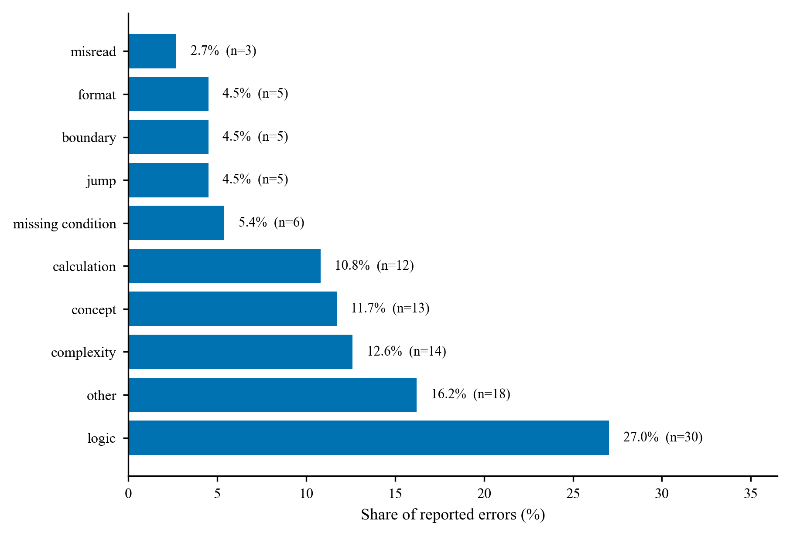
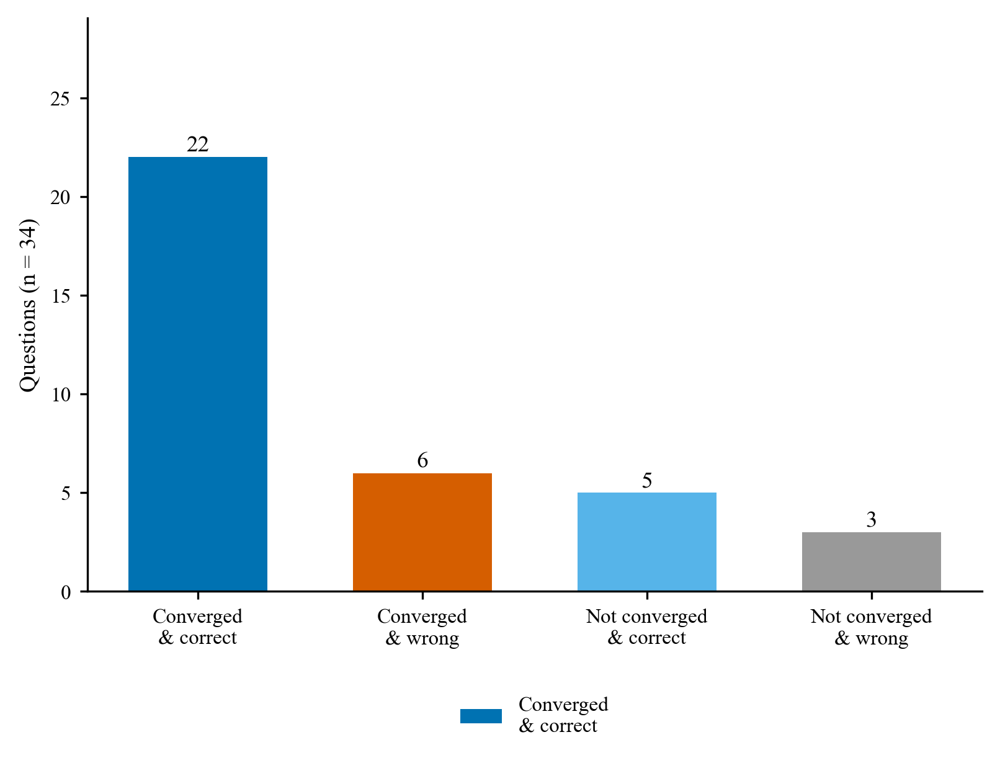

# HY3Coder 分析报告

> 生成时间：2026-09-10 00:10 ｜ 数据：`data/outputs/`（eval/refine 严格分离）

## 1. 评估总览

| 指标 | 数值 |
|---|---|
| 评估样本数 | 359 |
| 答案准确率 | 90.0% |
| 过程正确率（主口径：仅 fatal 计入过程错） | 84.4% |
| 仅 minor 记录样本 | 23（主口径计过程正确 / 副口径计过程错） |
| 判定分布 | ANSWER_INCORRECT=8, CORRECT=303, PROCESS_INCORRECT=33, SILENT_FAILURE=15 |
| 沉默失败检出 | 15（4.2%） |
| 过程正确率 95% CI | [80.3%, 87.8%]（Wilson） |

**基线修订说明（2026-09-10 补充 hidden）**：为补齐原先缺隐藏用例的题目（ABC 13 题 + CF 129 题），按题面约束补充了合法边界 hidden 用例；用同一次求解的模型代码在新用例上重跑，仅**答案对错**受影响（过程评估的推理链未变，不重跑 LLM 审查，只按流水线既有的确定性规则同步 `verdict` 一致性）。实测 **2 题答案由对转错**：`A1169`（abc383_e，原判 CORRECT，verifier 未发现该边界缺陷 → 属评估器漏检，verdict 修正为 ANSWER_INCORRECT）、`C2063`（cf1868c，原判 SILENT_FAILURE，复杂度 fatal 成立且答案实际也错 → 修正为 PROCESS_INCORRECT）。表中数字为本修订后口径（补充前为 90.5% / 84.7%）；§2 分档/分层表、§3 分类统计与 §6 人工抽检均已按本修订更新，§8 算法类别细表为 2026-09-09 基线快照（差异 ≤1 题）。


**分平台概览**（均为正式 run-eval）

| 子集 | 样本 | 答案准确率 | 过程正确率 |
|---|---|---|---|
| ABC 自建 | 175 | 93.7% | 90.3% |
| CF 自建 | 184 | 86.4% | 78.8% |

**结果随机性与稳定性说明**：本报告为**单次求解**结果（每题一次 Hy3 调用，模型采样有随机性）。二次抽样稳定性检验（两种子各取 60% 分档重抽，比较过程正确率）：抽样A=84.1% vs 抽样B=81.8%，漂移 **2.3pp**，判定为稳定（漂移 <5pp）。若需收紧指标，可对全量做多次求解取均值——本报告作为单次基线，Wilson 区间与抽样稳定性已给出不确定性上界。


### 1.1 记忆暴露检测（官方原题镜像 contamination 探测，2026-09-09）

题集为官方原题镜像，成绩是能力加记忆的上界。本节用行为探测估计记忆暴露：分层抽样 30 题（ABC/CF × basic/medium/hard 每层 5，seed 42），每题两个 probe，分别是出处召回（是否记得竞赛/题号）与解法盲答；判定见 `reports/CONTAMINATION_METHOD.md`，原始数据 `data/outputs/contamination_probe.jsonl`。


| 指标 | 数值 |
|---|---|
| 探测样本 | 30 |
| 自称见过（P1=seen） | 29（96.7%），迎合偏差高，不作暴露证据 |
| 出处精确命中（强证据） | 6（20.0%，95% CI [10%, 37%]） |
| 命中难度分布 | basic 4 / medium 2 / hard 0 |
| 命中样本 | `A1023`（abc300_c）, `C2001`（cf1a）, `C2002`（cf71a）, `C2008`（cf1730a）, `C2072`（cf719a）, `C2149`（cf568a） |


与正式评测交叉（记忆红利近似）：


| 组 | 样本 | t0 答案正确 |
|---|---|---|
| 出处命中组 | 6 | 5（83.3%） |
| 未命中组 | 24 | 22（91.7%） |


读数：模型对官方原题普遍自称熟悉（29/30），但精确出处记忆只出现在入门~基础经典题（Theatre Square、71A、719A、1730A、ABC300C 等），中等以上难度未观察到背题式出处记忆。出处命中组与未命中组在 t0 评测的答案正确率无显著差异，未观察到记忆显著抬高成绩。反例 `C2149` 记得出处（568A）但正式评测仍答错，说明记忆存在不等于解题能力。局限：无法实证训练语料，行为探测有假阴假阳，且命中集中于超经典题，暴露的威胁度低。方法全文见 `reports/CONTAMINATION_METHOD.md`。

## 2. 分层退化分析

### 2.1 平台难度轴（rating/difficulty 校正后 basic/medium/hard）


| 难度 | 样本 | 答案准确率 | 过程正确率 |
|---|---|---|---|
| basic | 68 | 94.1% | 91.2% |
| hard | 126 | 82.5% | 74.6% |
| medium | 165 | 93.9% | 89.1% |


### 2.2 统一难度轴（Hy3 多专家评审 diff_score，0-100 语义档跨平台可比）


难度分 `diff_score` 由 Hy3 三专家盲打加仲裁给出（0-100，与平台无关），见 §A 方法与验证。切档按绝对语义刻度（0-20 入门/20-40 基础套路/40-60 中等/60-100 难~极高难），与打分语义锚一致，不做样本均分，保证档位含义跨数据集稳定。


| 语义档 | diff_score 区间 | 样本 | 答案准确率 | 过程正确率 | 95% CI |
|---|---|---|---|---|---|
| 入门~一眼题 | [0,20) | 79 | 96.2% | 93.7% | [86.0%, 97.3%] |
| 基础~套路 | [20,40) | 171 | 94.7% | 90.1% | [84.7%, 93.7%] |
| 中等 | [40,60) | 74 | 82.4% | 71.6% | [60.5%, 80.6%] |
| 难~极高难 | [60,100) | 35 | 68.6% | 62.9% | [46.3%, 76.8%] |

**临界点判定**：过程正确率随统一难度语义档下降（入门~一眼题 93.7% → 难~极高难 62.9%）。
首次显著跌落（≥8pp）出现在**中等**（diff_score ≥ 40）——模型过程能力在该难度区间开始明显失守。

diff_score≥80 的极高档仅 5 题（[60,100) 共 35 题），样本太小——temp0.9 与 temperature=0 两次求解在该子档答案分别为 3/5 与 5/5，读数被小样本支配，故并入「难~极高难」一行解读，不作单独能力结论；临界点结论限定在入门~中等区间。


**Fig. 1** 统一难度分档下答案准确率（实线）与过程正确率（虚线）随 diff_score 的退化。高难段 [60,100) 含 35 题（80+ 的 5 题并入）；过程正确率自中等档（71.6%）起显著跌落，是高难能力边界的第一条证据线。


## 3. 错误类型分布

| 错误类型 | 数量 | 占比（过程错误样本中） |
|---|---|---|
| 逻辑缺陷 | 30 | 27.0% |
| other | 18 | 16.2% |
| 复杂度不达标 | 14 | 12.6% |
| 概念理解错误 | 13 | 11.7% |
| 计算错误 | 12 | 10.8% |
| missing_condition | 6 | 5.4% |
| 跳步推导 | 5 | 4.5% |
| 边界条件 | 5 | 4.5% |
| 格式不符 | 5 | 4.5% |
| 题意误读 | 3 | 2.7% |



**Fig. 2** 过程错误类型分布（占全部已报告错误的比例，条形末端给出条数与占比）。逻辑缺陷与实现层错误（other/复杂度）合计过半，指向实现严谨性与建模正确性。


## 4. 典型 case 归因

### A1098（algorithm / hard）
- 判定：**SILENT_FAILURE**（置信度 0.95）
- 题目：Score : $400$ points


### Problem Statement
There is a sequence $A = (…
- 答案正确：True，测试通过率：1.0
- 定位发现：第2步 逻辑缺陷：并查集设计未考虑线性探测的环形回绕：parent[pos] = find(pos+1) 在 pos ；第4步 边界条件：代码在 pos=N 时访问 parent[N+1]（数组大小 N+1，合法下标 0..N），且写 A

### A1148（algorithm / hard）
- 判定：**SILENT_FAILURE**（置信度 0.93）
- 题目：Score : $425$ points

### Problem Statement
You are given a tree with $N$ vertic…
- 答案正确：True，测试通过率：1.0
- 定位发现：第2步 概念理解错误：错误断言节点必须保留当且仅当本身是关键点或子树（以1为根）含关键点。反例：链1-2-3, K={3}；第2步 逻辑缺陷：算法等价条件逻辑错误：仅依子树含关键点计数会保留非必要桥接祖先。正确需节点是关键点，或≥2子树枝含关

### A1164（algorithm / medium）
- 判定：**SILENT_FAILURE**（置信度 0.90）
- 题目：Score : $425$ points


### Problem Statement
There is an $N \times N$ g…
- 答案正确：True，测试通过率：1.0
- 定位发现：第3步 复杂度不达标：步骤3断言算法总复杂度为O(M log M)时间、O(M)空间，但实际步骤4代码中对每个约束列c遍历

### A1174（algorithm / hard）
- 判定：**SILENT_FAILURE**（置信度 0.90）
- 题目：Score : $450$ points


### Problem Statement
There are $N$ servers numb…
- 答案正确：True，测试通过率：1.0
- 定位发现：第4步 逻辑缺陷：构造实现中盲目顺序消耗spare边，且用 fu == y（y为弹出的未连通分量代表整数，未做dsu.

### C2029（algorithm / medium）
- 判定：**SILENT_FAILURE**（置信度 0.95）
- 题目：F. A Bit Odd
time limit per test2 seconds
memory limit per test256 megabytes

Al…
- 答案正确：True，测试通过率：1.0
- 定位发现：第2步 跳步推导：步骤2给出充要条件：总逆序对奇或存在分割点k使前缀1奇且后缀0奇则Alice赢，否则Bob必胜。前置

## 5. 修正闭环（ReAct 前后对比）

### 5.1 针对答案错样本的 ReAct 修正（真实度补偿，2026-09-09）

测试对象是 temperature=0 正式评测中 `answer_correct=False` 的全部 36 题。与纯文本 refine 相比，每轮反馈除 verifier 审查文本（findings→修订指令，仅 fatal 驱动）外，还附上非隐藏样例的沙盒执行结果（失败用例的输入、期望输出与实际输出），作为客观观察；重验证时通过 `execution_feedback` 喂给双视角与 ARBITER（公开样例失败时不得判 CORRECT）。终局用全部用例（含 hidden）沙盒复核答案真值，记录见 `data/outputs/refine_wrong_t0.jsonl`，脚本 `scripts/run_refine_wrong_t0.py`。（样本数由 34 增至 36：2026-09-10 补充 hidden 后新暴露的两道答案错题 A1169/C2063 已并入。）

| 指标 | 数值 |
|---|---|
| 修正样本数（全部答案错） | 36 |
| 文本收敛（verdict → CORRECT） | 28（77.8%） |
| 最终答案修对（全量含 hidden 沙盒） | 27（75.0%） |


文本收敛与沙盒真值交叉：两者一致为完全成功，其余三类是边界样本。


| | 最终答案修对 | 最终仍错 |
|---|---|---|
| 文本收敛 | 22（真收敛） | 6（假收敛：hidden 缺陷仍在） |
| 未文本收敛 | 5（修对但评估器未认可） | 3（未改善） |


按平台（多标签题不重复计入）：

| 子集 | 样本 | 文本收敛 | 最终修对 |
|---|---|---|---|
| ABC 自建 | 11 | 10（90.9%） | 7（63.6%） |
| CF 自建 | 25 | 18（72.0%） | 20（80.0%） |


按难度：

| 难度 | 样本 | 文本收敛 | 最终修对 |
|---|---|---|---|
| basic | 4 | 4（100.0%） | 2（50.0%） |
| medium | 10 | 8（80.0%） | 7（70.0%） |
| hard | 22 | 16（72.7%） | 18（81.8%） |


修正轮次分布：1 轮 25 题，2 轮 1 题，3 轮 10 题


文本收敛与沙盒真值一致才算完全成功；6 题文本收敛但 hidden 仍错（假收敛），反映评估器只能看到公开用例；5 题沙盒已修对但评估器未判收敛，是定位与接受滞后的另一侧证据。本节同时是过程评估定位质量的下游观察面，与第 6 节定位准确率相互印证。新并入的 2 例一正一反：`C2063` 3 轮真收敛（复杂度缺陷修正后全量通过），`A1169` 1 轮即判 CORRECT 但全量仍 60%——与它的 eval 期漏检同源，说明"公开用例全过"时评估器容易接受未经验证的推理链。




**Fig. 3** 36 个答案错样本经 ReAct 修正后的四象限分布：柱顶为样本数，色块含义见图例。真收敛（收敛且最终全对）22 题；文本收敛但 hidden 仍错 6 题、修对但未获评估器认可 5 题，构成文本判定与沙盒真值的两条边界。


过程性修正记录（2026-09-09）：

- 编译错误反馈管道缺陷与修复。首轮实现把运行/编译错误截断到 200 字符，编译器真正的诊断行（如 `shadows a parameter`、`no match for 'operator<'`）在模板堆栈之外，模型只见 `error: declaration` 无法定位，C2070/C2082 连续三轮修不好同一编译错误。本地手动编译确认沙盒判定正确（代码确不可编译）。改为从完整 stderr提取含 `error` 的诊断行后，两题均首轮收敛且最终全量通过。执行反馈应保留原始诊断，截断会削弱真实度补偿。

- 三轮未收敛样本人工校验。共 8 题，逐条核对每轮 findings 与沙盒事实，未发现评估器误报。

  - 修正能力不足（终局仍错 3 题）：`C2049`（组合计数公式三轮反复换仍错、自测虚报）、`C2085`（只删最右 vs 删任意位置、输出索引 vs 计数等概念反复错）、`C2121`（DP 截断/最短结尾维护反复错）。

  - 评估器正确坚持、缺陷真实但公开用例覆盖不到（5 题，终局沙盒虽过不等于满足约束）：`A1071`（代码主循环每轮全表重建、最坏 O(N²)，N=1e6 必 TLE，人工抽查终版代码属实）、`C2060`（p,q 范围 ±1e18 下小范围枚举无保证、最坏复杂度 4e9 必超时）、`C2143`（分段公式存在边界反例）、`C2145`（贪心正确性引理被可验证反例击破）、`C2149`（扫描上界不足，isp[1] 曾误把 1 当素数）。这类缺陷公开小样例不会触发，过程评估的文本审查无法被沙盒替代。

## 6. 人工抽检

| 指标 | 数值 |
|---|---|
| 已标注样本 | 48 / 48 |
| 定位准确率（答案错误样本 29） | 96.6% |
| 三层复核 · 完全相符（分级正确） | 17 |
| 三层复核 · 层次不符（fatal/minor 打反） | 1 |
| 三层复核 · 完全不符（系统误报） | 1 |
| 误报率（判过程有错 19） | 5.3%（仅完全不符）～ 10.5%（含层次不符） |

口径：定位准确率的分母是答案错误样本（用标准答案判定），误报率的分母是答案正确样本中被评估器判为过程有错者（经人工抽检确认）。三层复核针对系统对 fatal/minor 的分级是否属实：完全相符即分级正确；层次不符即分级打反（系统把 minor 判成 fatal，属误报侧）；完全不符即系统认为有错而实际过程正确。误报率区间取两个端点：仅完全不符（下界，minor 也算过程错）到含层次不符（上界，minor 不算过程错）。

**层次基线**：本节按**当前**（2026-09-10 补充 hidden 后）t0 口径计——答案错误 29 条、答案正确但被判过程有错（误报率分母）19 条。补充前（2026-09-09 抽检当时）为 **28 / 20**，定位 27/28 = 96.4%、三层复核 match 18。这一条之差来自被抽检的 `C2063`：补充 hidden 后其答案由对转错、verdict 由 SILENT_FAILURE 修正为 PROCESS_INCORRECT（见 §1 基线修订说明），故从误报率分母移入定位分母，且系统对其复杂度缺陷的定位经人工复核为命中。

## 7. 真实评测检出的 SILENT_FAILURE 样本留档

真实 Hy3 评测中 verifier 检出 `SILENT_FAILURE`（2 条：答案正确但过程存在根本缺陷），逐条留档如下。每条含题目源（contest）、检测时间、定位缺陷与步骤、沙盒通过率；flaw_answer 为当时模型的真实求解输出（含代码），非人工编造。检出计数已计入第 1 节判定分布。

- **`A1042`**（AtCoder-自建 · `abc257_d` · medium）
  - 题面：Score : $400$ points


### Problem Statement
There are $N$ trampolines on a two-dimensional planar town where Takahashi lives.  The $i$-th trampoline i…
  - 缺陷类型：概念理解错误
  - 来源说明：真实评测检出：2026-09-03T17:06:38 · 来源 eval_selfbuilt_all.jsonl · 沙盒通过率 1.0 · answer_correct=True · verifier=SILENT_FAILURE · 缺陷定位: step2[concept] 二分上界估算错误：误将最大曼哈顿距离等同于最大坐标差2e9，实际|x_i-x_j|+|y_i-y_j|最大可达4e9（x,y分别取±1e9极值），导致设定上界2e9+10可能不足。代码继承此错误(hi=2000000010)。在极端输入下会输出错误答案，但当前测试集全过使最终答案碰巧正确。
  - 陷阱步骤数：5（含代码 ✓）
- **`A1148`**（AtCoder-自建 · `abc368_d` · hard）
  - 题面：Score : $425$ points

### Problem Statement
You are given a tree with $N$ vertices numbered $1$ to $N$. The $i$-th edge connects vertices $A_i$ and $B_i$.

Cons…
  - 缺陷类型：概念理解错误
  - 来源说明：真实评测检出：2026-09-03T02:03:03 · 来源 eval_selfbuilt_all.jsonl · 沙盒通过率 1.0 · answer_correct=True · verifier=SILENT_FAILURE · 缺陷定位: step2[concept] 算法思路错误地要求节点u在‘自身为关键点或某个子节点子树含关键点’时必须保留以连通到上层（根）。实际上极小连通子树只需连通所有关键点彼此之间，并不要求连通到原树根；若根不是关键点且仅有单侧分支含关键点，根及传递链上的非关键点不应全部保留（例如树1-2，V={2}时最小顶点数为1，但所述算法会输出2）。该步骤结论‘通过D; step2[logic] 算法思路错误地认为只要节点子树中含有关键点（或自身为关键点）就必须保留以连通到上层，但未区分根节点无父节点的情况：若所有关键点均位于根的某一子树中（如K=1且关键点非根），根及其无关祖先不应被保留，最小子树应仅含关键点本身（或对应连通块）。该DFS会统计从根到关键点的整条路径，得到错误过程结论，但代码在沙盒测试中可能因
  - 陷阱步骤数：5（含代码 ✓）

## 8. 能力画像与边界分析

### 8.1 算法类别 × 能力边界（按 `alg_classes` 标签统计）

统计按题集人工归一的算法类标签进行，多标签题计入多个类（类别不互斥）；平均 diff_score 用于区分该类别本身偏难，还是同难度下能力偏弱。全库过程正确率基线 84.4%，答案正确率基线 90.0%（359/359 题有标签）。


| 算法类 | 样本 | 答案准确率 | 过程正确率 | 平均 diff_score | 主要过程错误类型 |
|---|---|---|---|---|---|
| construct | 27 | 85.2% | 70.4% | 41 | 逻辑缺陷(4)，missing_condition(3) |
| twoptr | 14 | 71.4% | 71.4% | 44 | 逻辑缺陷(4)，题意误读(1) |
| binary | 37 | 83.8% | 75.7% | 40 | 逻辑缺陷(5)，other(4) |
| brute | 64 | 87.5% | 79.7% | 37 | 逻辑缺陷(9)，复杂度不达标(4) |
| graph | 88 | 87.5% | 80.7% | 38 | 逻辑缺陷(8)，other(5) |
| ds | 58 | 86.2% | 81.0% | 43 | 逻辑缺陷(6)，复杂度不达标(3) |
| dp | 75 | 85.3% | 81.3% | 42 | 逻辑缺陷(8)，概念理解错误(4) |
| greedy | 70 | 87.1% | 81.4% | 35 | 逻辑缺陷(9)，other(2) |
| math | 122 | 89.3% | 82.0% | 35 | 逻辑缺陷(9)，other(6) |
| sim | 91 | 92.3% | 84.6% | 26 | 复杂度不达标(6)，逻辑缺陷(5) |
| sort | 34 | 88.2% | 85.3% | 35 | 复杂度不达标(3)，other(1) |
| game | 9 | 100.0% | 88.9% | 36 | 跳步推导(1) |
| string | 17 | 100.0% | 94.1% | 26 | 复杂度不达标(1) |

**边界读数**：过程正确率低于全库基线 ≥8pp 的类别为**能力弱点边界**——`construct`（70.4%，n=27）、`twoptr`（71.4%，n=14）、`binary`（75.7%，n=37）；其中平均 diff_score 高的类别主要受题目难度驱动，diff_score 接近基线的类别属于同难度下确偏弱的一类。
显著高于基线的类别（强项）：`string`（94.1%）。


边界解读：主体算法类（math/sim/graph/dp/greedy/ds，覆盖绝大多数样本）过程正确率 81%–85%，与全库基线基本持平，无系统性短板。弱点集中在 construct / twoptr / binary 三类，其主要过程错误均为逻辑缺陷与条件遗漏（missing_condition），指向构造与约束建模的严密性不足，而非知识缺失。string / game / twoptr 等样本不超过 16 的类别读数置信有限，只作方向性提示。该维度与 §2 难度边界、§3 错误类型边界互相独立，构成能力边界的三条证据线。


**Fig. 4** 13 个算法类别的答案准确率（蓝色）与过程正确率（橙色），按过程正确率升序；条形末端为百分数。construct / twoptr / binary 低于全库基线 ≥8pp，是算法类别维度的能力边界。


### 8.2 弱项清单


| 维度 | 观察 | 建议 |
|---|---|---|
| 复杂度控制 | 见第 3 节错误类型占比，若 `复杂度不达标`/`边界条件` 占比高，反映算法场景实现严谨性不足 | 增加静态检查前置；对声明复杂度与实现做一致性校验 |
| 跳步推导 | 算法场景 `跳步推导` 高发说明步骤颗粒度过粗 | 验证 prompt 强化逐步自含性要求 |
| 沉默失败 | golden 检出率与抽检误报率联动监控 | 高误报时收紧定位条件，低检出时增强回溯审查 |
| 分层退化 | 平台难度轴见 2.1；统一难度轴见 2.2（临界点 = 首次 ≥8pp 跌落的 diff_score 档） | 对临界点之上补充针对性用例 |

---

_数据纯净性说明：以上全部指标仅基于 eval 模式结果；refine 数据单独用于第 5 节对比，不混入评估指标。_


---

# 附录 A：评测集构造与统一难度分层方法


以下为评测题集构建与统一难度分层（Hy3 多专家评审工作流）的方法说明，源自 `reports/DIFFICULTY_SCORING_METHOD.md`。


本文整理难度分层的思路和结果，面向"评测题集"章节。数据日期 2026-09-06，涉及 `abc_selfbuilt.jsonl`（175 题）与 `cf_selfbuilt.jsonl`（后续扩至 184 题）。执行脚本 `scripts/score_difficulty.py` / `analyze_diff_scores.py` / `apply_diff_score.py`。

### A.1 为什么需要统一难度分层

我们要回答"模型能力是否随题目难度退化"这个问题，这要求题集先有一个可信、跨数据集可比、可复现的难度标签。它既是分层退化分析的自变量，也用于抽样均衡。

难度的麻烦在于它是多因素复合的：思维难度、实现难度、边界隐蔽性、算法深度彼此独立，没有单一题面特征能直接度量。我们下面先说明为什么不直接用品面自动特征，再给出实际采用的模型评审工作流和它的验证结果。

### A.2 为什么不直接用题面自动特征分层

### 2.1 数据规模不能当难度用

起初自然想到用约束里的数据规模上限（最大的 N）做分档，实际验证后走不通。原因有二。

一是"值域 ≠ 规模"。题面里出现的大数值几乎都是元素值域或答案上界（如 A_i ≤ 1e9），不是输入规模。想用解析规则区分二者，碰到构造题、数位题、博弈题（"规模"和"难度"本来就脱钩）就失效。

二是"规模 ≠ 难度"。n ≤ 1e18 的数位题可以是 O(log n) 的简单题，n ≤ 300 的搜索题可能状态爆炸。即便人工校正语义错误，按规模分档后各档过程率仍不单调（ABC 各档 85/89/80/89%，CF 83/77/50/70%）。数据规模描述的是约束形态，不是难度。

### 2.2 复杂度和知识点也不合适

参考解复杂度需要逐题静态分析 C++ 代码，工程量大且对新题不成立；而且 O(n log n) 未必比 O(n²) 难（后者可能是巧妙剪枝）。知识点（贪心、DP、图论）是算法类别，类别内部难度跨度很大（同为 DP，入门背包和树形 DP 差一个量级），没法当排序轴。这两类更适合作为正交的覆盖维度，说明"题集覆盖了哪些算法类别"，但回答不了"这题多难"。

### 2.3 官方评分可信，但不能直接跨平台合并

我们选的两套题都有平台官方的难度信号：Codeforces 有题目 rating（ELO 型，跨场可比），AtCoder ABC 有官方分值加社区 ELO 难度。官方 ELO 是对选手能力比较可信的度量，问题在于两平台的评分准则不同——用户群体、ELO 起点、色带划分都不一样，CF rating 1800 和 ABC difficulty 1800 并不是同一个难度。直接把两平台的题按各自 rating 切进同一 basic/medium/hard 桶，会让"ABC 的 medium"和"CF 的 medium"语义不一致，分层退化分析就失去意义。

### A.3 采用的做法：模型多专家评审

### 3.1 思路

把"难度"从平台评分体系挪到模型自身的评审能力上：让 Hy3 分别扮演三种视角的算法竞赛专家，对同一道题盲打一个 0-100 的连续难度分（不给平台、不给官方 rating），再由仲裁官综合成最终分 diff_score。这样所有题落在同一把与平台无关的尺子上，跨平台可比由构造保证，而不是靠换算公式。

### 3.2 工作流（每题四次模型调用）

```
题面 + 参考解（平台 AC 提交）
  ├─ 专家1 competitor：实战选手视角，比赛时会觉得这题多难
  ├─ 专家2 theorist  ：算法理论视角，所需知识与思维深度
  ├─ 专家3 adversary ：反例猎手视角，边界陷阱与实现易错度
  │      （三专家各自输出 {score 0-100, level, hint}）
  └─ 仲裁官：读三份独立判断 → final_score + rationale
```

几个设计点：盲打，prompt 明确要求忽略题面里残留的 Score/场次/平台线索，只按算法内容和参考解判断；分数用连续 0-100 而不是预置三档，报告层再按固定语义刻度切档（0-20 入门/20-40 基础套路/40-60 中等/60-80 难/80-100 极高难），不做样本均分，以免档位随样本分布漂移；三视角故意选得正交，大分歧时由仲裁裁决谁更可信；参考解用平台 AC 提交，保证专家看到的是官方认可的解法，评分锚定在真实解法难度上。

这套流程对新数据集的接入成本很低：入库后跑同一工作流即可，没有平台专属逻辑。

### A.4 验证

难度标签是对主观量的测量，需要有客观基准。我们做了两层验证。

### 4.1 与官方 ELO 的相关性

以平台官方 ELO 难度为外部基准（ABC 用 AtCoder Problems difficulty，CF 用 rating），算 final_score 的 Spearman 秩相关：ABC 175 题为 0.706，CF 175 题为 0.816，都是强正相关。也就是说模型评审给出的排序和经过大量真实选手验证的官方难度显著一致，判断不是噪声。

### 4.2 人工盲打对照

流程定稿前做了 20 题的人工抽检，其中 15 题是三专家分歧很大的（极差 > 30），5 题分歧小。由隔离上下文、看不到已录分数的独立评审重新盲打，对照已录的 final_score。以官方 ELO 为真值：

| 评分来源 | 全部 20 题 | 大分歧 15 题 |
|---|---|---|
| 仲裁 final_score | 0.848 | 0.704 |
| 独立盲打分 | 0.798 | 0.650 |
| 三专家中位 | 0.767 | 0.511 |
| 单专家（任一） | ≤0.75 | ≤0.44 |

三点结论：在大分歧样本上仲裁 final 仍优于独立盲打分和任一单专家，说明仲裁不是取平均，而是在分歧处做了更接近真值的判断；抽检前我们担心"反例专家系统性打高分"会带偏结果，数据表明大分歧题往往确实难（多为构造/思维题），反例专家的方向是对的，仲裁加权后更贴近官方（0.704 > 0.650）；盲打分和 final 差 12-15 分不算不合格，那是两把主观尺子的自然差，真正该比的是谁更贴近官方真值，这一点 final 占优。

### 4.3 分层单调性

难度标签的价值最终要看"能力是否随难度退化"。按绝对语义档切档，各档过程正确率单调下降。下表是方法定稿时的快照，题集后续扩入 CF 难档题后各档样本见分析报告 §2.2 的实时统计：

| 语义档 | 样本 | 过程正确率 |
|---|---|---|
| 入门~一眼题 [0,20) | 79 | 94.9% |
| 基础~套路 [20,40) | 170 | 78.8% |
| 中等 [40,60) | 69 | 71.0% |
| 难 [60,80) | 27 | 55.6% |
| 极高难 [80,100] | 5 | 60.0% |

第一次明显跌落（≥8pp）出现在"基础~套路"档（diff_score ≥ 20）。两平台在语义轴上连续无断层（ABC 分布在 [0,80)，CF 覆盖到 80 以上），说明统一难度分可以作为跨平台分层退化分析的主轴。难和极高难两档样本偏少、置信区间较宽，能力分析时我们会把两档合并成高难段 [60,100] 给聚合读数，语义档表仍保留五档结构对齐打分刻度。

### A.5 局限

这套方法产出的是一把相对可比的统一尺（排序和分档可靠），不是绝对物理量；跨平台可比靠同尺盲打保证，数值语义以分档和排序为准。验证以官方 ELO 为基准，如果以后引入没有官方评分的自构题，需要按人工专家标注重做一遍上面的盲打抽检。专家分本身受模型能力影响，模型可能对某类题有系统性偏差，多视角加仲裁加抽检只能缓解、不能完全消除。

### A.附：执行与复现

```bash
python scripts/score_difficulty.py --quiz abc_selfbuilt.jsonl --resume
python scripts/score_difficulty.py --quiz cf_selfbuilt.jsonl --resume

python scripts/analyze_diff_scores.py

python scripts/apply_diff_score.py

data/outputs/diff_scores.jsonl   # 每题 final + 三专家 + 仲裁理由
data/questions/*.jsonl           # metadata.diff_score
```

简要回顾：正则和硬编码不可泛化，平台 rating 又无法直接合并，所以改用模型多专家盲打 0-100 加仲裁的统一尺；相关性 0.71/0.82、人工盲打 0.85 两层验证通过后，分层退化分析就在这把尺上展开。


---

# 附录 B：过程评估方法与新旧版本对比


以下为过程评估器的判定方法说明（severity 分层、重建测试、程序化一致性裁决、静态规则校验补盲），源自 `reports/PROCESS_EVAL_METHOD.md`（2026-09-09 更新定稿）。


与旧版评估器的对比：

- 旧版（2026-09-03 定稿，双视角 LLM 审查加仲裁、无 severity）：任何 finding 都驱动“过程有错”，误报率被结构性推高；verdict 无程序化兜底，出现漏检（曾修复“答案错却判 CORRECT”的漏检）；规则校验仅支持 Python，CF/ABC 主场景（C++）全部失效。旧版抽检产物：`data/outputs/audit_review.md`（27 题模板）、`data/outputs/audit_records_full.jsonl`（40 条回填，双视角口径）。

- 本版（2026-09-07 severity v1）：在相同判定标准下对难题区间 28 条 re-verify，10 条判定变化——误报剥离 2 条、漏检补抓 3 条（C2084/C2102/C2119，人工核验全为真 fatal）、语义细化 5 条；小样本误报率 0/4。说明 severity 版并非靠放宽判定压误报，而是在同一标准下更精确。

- **全量人工抽检**（本报告第 6 节，温度 0 全量复跑版，2026-09-09 定稿）：48 条全部回填——答案错误样本 29 条定位准确率 96.6%（唯一 miss 为 C2077，根因步骤与系统定位不一致）；误报率 5.3%（仅完全不符）～10.5%（含层次不符），三层复核 match 17、level_mismatch 1（C2104，推导缺陷被步骤 5 自纠仍判 fatal）、fp 1（A1124，overflow指控在合法输入域不可达，沙盒 20% 失败源于违反 `N≠M` 约束的非法 hidden 用例，已修题库并留档，详见下方 B.4.3）。此前 6 条 fatal/minor 争议（C2029/C2062/C2094/C2095 维持 fatal、C2118/C2140 判 minor）裁决结果已并入本版分层。


本文整理过程评估器怎么搭、为什么这样搭、以及怎么验证它可靠，面向"过程评估设计"和"过程评估器有效性验证"两章。数据日期 2026-09-08；判定版本为 severity 语义（fatal/minor + 重建测试），模型 Hy3，相关代码在 `src/rex/verifier/`、`src/rex/executor/static_check.py`。姊妹篇：`reports/DIFFICULTY_SCORING_METHOD.md`（题集难度分层）。

### B.1 要回答的问题

对一个可验证场景（算法竞赛题）的解题过程做评估，不能只看最终答案对不对，还要判断推理过程是否站得住、错在哪一步、属于哪一类错误，并识别一类隐蔽样本：最终答案正确、但推理过程支撑不了这个结论。

难点在于"过程是否成立"是开放判断。解题过程的自然形态就是省略平凡推导、直接引用公式定理，要求逐步展开一切会误伤大量正确答案；反过来，答案全对、用例全过的过程也可能有致命缺陷（复杂度超限、数组越界、分支遗漏恰好没被用例覆盖），这类缺陷必须识别，否则评估器形同虚设。这两条要求互相拉扯：判严了误报多，判松了漏检多。评估器搭建的核心，是在"平凡省略可以豁免"和"实质缺陷必须检出"之间划一条可操作、可复现、可验证的线。

### B.2 为什么不沿用旧判定

旧版评估器（2026-09-03 定稿）是"双视角 LLM 审查加仲裁"，当时已经能判过程正确性、定位错误、归类错误类型、识别 SILENT_FAILURE。但在有效性验证里暴露出三个结构性问题。

#### B.2.1 任何发现都驱动"过程有错"

旧版只要发现一条 finding（哪怕只是自测文字笔误、表述不精确）就判 PROCESS_INCORRECT 或 SILENT_FAILURE。后果是误报被结构性推高：答案正确、推理成立的样本，只因为一句无害表述瑕疵就被判过程错，进到误报率分母，人工核验后大量推翻。同时小错误没有归类位置，表述瑕疵和误用定理被同等对待，缺一个"只记录、不判错"的档。

#### B.2.2 一致性靠模型自觉，没有程序化兜底

模型可能自相矛盾：报了实质缺陷却仍判 CORRECT，或答案客观正确、只有 minor 瑕疵却判过程错。旧版没有用"沙盒答案正确性加 findings 严重度"做程序化的最终裁决，verdict 语义完全交给采样。

#### B.2.3 规则校验有语言盲区

复杂度声明一致性、死循环检测这类规则校验原来基于 Python AST。但算法主场景的代码大部分是 C++（实测 CF 128/184、ABC 80/175），这些题目的复杂度比对、死循环、递归检测全部失效，规则校验在算法主场景基本形同虚设。

### B.3 现在怎么做

#### B.3.1 把"发现问题"和"是否判错"分开

重构的出发点是拆成两个正交维度。发现维度是 findings，记录一切可疑点，每条带错误类型（10 类）和严重度（fatal/minor），这是重构新加的字段。裁决维度是 verdict，只由 severity 为 fatal 的 finding 驱动；minor 只记录、不改变 verdict。这样 trivial 的"任何瑕疵都当过程错"问题从根上被解决。

#### B.3.2 重建测试是缺陷判定的总闸

对每条疑似缺陷先做重建测试：去掉或修复这句话后，剩余推理链、题面条件、领域常识能否重新推出结论。能重建，说明缺的只是装饰性表述或平凡推导，归 minor；不能重建，说明结论依赖未给出的关键推理或该步断言本身有错，归 fatal。解题关键引理（贪心最优性、组合计数、游戏必胜性）只写"显然"或"等价于已知结论"一带而过，判 fatal 跳步。这条判据给出了可复现的操作标准，不依赖评审对某类错误的主观敏感度。

#### B.3.3 用沙盒信号和 severity 做程序化裁决

verdict 最终由沙盒客观信号加 severity 程序化裁决（`pipeline._reconcile_verdict`）：

| 沙盒答案 | findings 含 fatal? | 结果 |
|---|---|---|
| 正确 | 有 | SILENT_FAILURE（答案对但过程有实质缺陷） |
| 正确 | 无（全 minor/空） | CORRECT（把 minor 被提升为过程错的误报剥掉） |
| 错误 | 有 | PROCESS_INCORRECT |
| 错误 | 无 | ANSWER_INCORRECT |

另外两处兜底：agent 层如果出现"fatal finding 加 verdict=CORRECT"的硬矛盾，强制改成 PROCESS_INCORRECT；refine 模式没有沙盒信号，全部 findings 是 minor 时视同过程正确，避免对表述瑕疵空转修正轮。

#### B.3.4 规则校验补盲

static_check 作为独立的实现/结果层审核（审 solver 产出的代码，和 verifier 对推理链文本的评估正交），按语言分发：Python 用 AST 做复杂度声明一致性、死循环、递归不终止、边界启发式；C++ 用 token 级启发式，去掉注释和字符串后配对括号，识别循环嵌套深度（粗估复杂度）、无 break 的恒真循环、没有非递归返回路径的递归。它不单独阻断 verdict，输出作为 verifier 的补充诊断证据。规则行为有正负例测试集放在 `tests/test_static_check.py`，可以单独跑。

#### B.3.5 判定流程

```
solve → 沙盒（答案正确性）+ static_check（规则校验，不阻断）
  → verifier V1（自含性）+ V2（全局回溯）各自给出 verdict/findings
  → ARBITER 总仲裁：复核双方判定并交付最终结果
     （无论 V1/V2 是否一致；findings 合并保留 severity；执行反馈说答案错时不得判 CORRECT）
  → fatal 与 CORRECT 的硬矛盾程序化改正
  → _reconcile_verdict（沙盒 + severity 权威裁决）
  → 指标：主口径（fatal-only）/ 副口径（minor 也计，REX_MINOR_AS_ERROR=1）
```

#### B.3.6 双口径

主口径是默认：verdict 由 fatal 驱动，minor 剥离。副口径把 minor 瑕疵也计为过程错误，用环境变量一键切换。报告和仪表盘并列展示两口径的数值，把"如果算上微小瑕疵结果差多少"摆到明面上，避免选口径的质疑。

### B.4 验证

评估器是测量工具，需要证明它可靠。我们从判定层、小样本有效性、全量抽检三个层面验证。

#### B.4.1 判定层单元测试

severity 驱动 verdict 的每条规则都有单测覆盖：fatal 加 CORRECT 矛盾强制改正、答案对加无 fatal 归 CORRECT、答案错绝不判 CORRECT/SILENT、refine 全 minor 视为正确、副口径分母扩大等。当前测试集共 102 项，全部通过。

#### B.4.2 小样本有效性验证（难题区间）

难度越高推理链越复杂、实现越容易有隐蔽缺陷，误报和漏检的可能性都最高，是评估器可靠性的压力区。我们用 severity 版 verifier 对 CF 难题区间（diff_score ≥ 60）的 28 条记录重跑判定（复用已有答案，重跑执行、静态、验证），对比新旧判定。28 条里有 10 条判定变化：

| 变化方向 | 条数 | 人工核验 |
|---|---|---|
| 旧过程错 → 新 CORRECT（误报被剥掉） | 2 | 两例都只是 minor（自测文字笔误等），判 CORRECT 合理 |
| 旧 CORRECT → 新 SILENT_FAILURE（漏检补抓） | 3 | C2084/C2102/C2119，全是答案全对但实现有根本缺陷，旧版漏检 |
| 旧 ANSWER_INCORRECT → 新 PROCESS_INCORRECT（语义细化） | 5 | 更精确，答案错且定位到具体 fatal |
| 旧 SILENT_FAILURE 保留 | 1 | C2133，真实 |

小样本误报率：分母是答案正确且被判过程有错的 4 条（C2084/C2102/C2119/C2133），人工逐条核验都确认真实问题，误报率为 0。同时新 verifier 还补抓了三个旧版漏检的真 SILENT，说明 severity 版不是靠放宽判定压误报，而是在同一套标准下更准。

#### B.4.3 全量人工抽检（温度 0 复跑版，2026-09-09 定稿）

按"答案对错 × 判定"对温度 0 全量复跑（359 条）的样本分层抽取 48 条，全部人工回填（规则和记录见 `data/audit/audit_rules.md` 与 `audit_records.jsonl`）。两轮争议逐条评审终审后结果如下。

- **定位准确率**：答案错误样本 29 条，命中 28/29 = **96.6%**。唯一 miss 为 C2077：系统把真实根因判在步骤 5（自测阶段虚构样例自圆其说），人工复核认为题意操作误读发生在步骤 2 建模（把"重复取区间"理解成"只取一个 L..R 区间"，样例 4 实际 22 与算法 15 不符却虚构输入掩盖）——判定方向正确（fatal 成立），但未定位到真实根因步骤。
- **误报率**：答案正确且被判过程有错的 19 条中，三层复核 match 17、level_mismatch 1（C2104）、fp 1（A1124）。副口径误报率 **5.3%**（1/19，仅完全不符）、主口径 **10.5%**（2/19，含层次不符）。
- **层次基线**：本节按**当前**（2026-09-10 补充 hidden 后）t0 口径计——答案错误 29 条 / 误报率分母 19 条；补充前（2026-09-09 抽检当时）为 **28 / 20**（命中 27/28 = 96.4%、三层复核 match 18）。差 1 条来自被抽检的 C2063：补充 hidden 后其答案由对转错、verdict 由 SILENT_FAILURE 修正为 PROCESS_INCORRECT，从误报率分母移入定位分母（其复杂度缺陷定位经人工复核为命中，人工标的 error_step_id=4）。
- 争议终审摘要（audit note 留档）：
  - C2104 → **minor**：步骤 2 分段公式漏 `x>n` 前提，但步骤 5 自行验证反例当场修正、代码用修正式且用例全过——"推导中间缺陷被自身验证纠正"，系统按 fatal 判过严（level_mismatch，主口径误报）。
  - C2077 → **fatal**（题意操作误读，非人名等无关误读，直接导致建模错误）。
  - A1174 → **fatal**（match）：构造缺陷真实，属评测用例未覆盖该边缘情况。
  - A1124 → **误报（fp）**：系统指控 `f(mid)=mid/N+mid/M-2·mid/L` 在 `N=1` 且二分中点逼近 `hi=9e18` 时 long long 溢出。经数学推演该边界不可达——二分首轮 `mid=(1+9e18)/2=4.5e18` 即已使 `cnt ≥ K_max`（合法最小密度约 `2/10^8`，`cnt(4.5e18)≈9e10 > K_max=10^10`），此后 `hi` 只降不升、`mid` 恒 ≤ 4.5e18，求和最大约 `4.5e18+2.25e18=6.75e18 < 9.22e18`，永不溢出；沙盒 20% 失败的唯一来源是非法 hidden 用例 `1 1 1`（`N=M` 违反题设 `N≠M`，此时无解，"期望输出 4e18"只是参考解二分上界初值在 `check` 恒假时不收缩的偶然行为）。本地用 3000 组合法随机输入（`N≠M`）对拍参考解 0 不一致，修复用例后 4/4 通过。**评测集用例质量问题已修复**：该非法 hidden 用例替换为合法压力用例 `1 100000000 10000000000`，并据修复后沙盒事实修正 eval 答案判定（原系统判定与 finding 保留留档）。A1124 暴露的是"坏用例污染答案判定 → 过程评估基于错误沙盒事实误报"的复合链路，误报率相应 +1。

此前 severity v1 定稿阶段对旧版（40 条抽检，22 答案错 + 18 答案对，误报率 5.6%～16.7%）的结论与上述温度 0 版一致：误报集中于"缺证明算 fatal 还是平凡省略"的尺度问题，其中 6 条争议（C2029/C2062/C2094/C2095 维持 fatal、C2118/C2140 判 minor）裁决后归入对应分层，并反映在本版 48 条抽检中（C2029/C2062 等在 t0 全量下重新出现并判 match）。

#### B.4.4 hidden 用例约束复核（2026-09-09）

在 A1124 抽检中发现其 hidden 用例 `1 1 1`（`N=M` 违反题设 `N≠M`，期望值是参考解在无解输入下的偶然输出）后，对所有 hidden 测试用例做了一次全量复核，以防同类坏用例污染评测。

**方法（两轮）**：
1. 自动一致性：每条 hidden 用**当前参考解**重新运行并与期望比对（浮点容差同评测；SPECIAL 题经 checker 验证输出合法性）。647 条 hidden 全部通过，无期望过期/参考解不一致。
2. 逐题约束核对：对含 hidden 的全部题目（ABC 162 题 + CF 49 题），逐条对照**题面约束**检查输入合法性（数值范围、互斥条件、结构约束如"至少 K 个 1-blocks"、每行至少一个合法字符等）。

**发现并修复 17 条违反各自题面约束的 hidden 用例**（替换为合法边界输入，期望由参考解重新生成；生成脚本 `gen_hidden_cases.py`/`gen_cf_hidden_cases.py` 的 BOUNDARY_INPUTS 已同步修正防回归）：

| 题目 | 原非法 hidden | 违反约束 | 修复为 |
|---|---|---|---|
| A1124 abc341_d | `1 1 1` | `N≠M` | `1 100000000 10000000000` |
| A1016 abc290_d | `1 2 1`、`5 8 5` | `K≤N` | `2 2 1`、`5 5 3` |
| A1025 abc235_d | `2 1` | `N≥2` | `2 2` |
| A1089 abc211_c | `c` | `\|S\|≥8` | `chokudaic` |
| A1107 abc342_c | `Q=0` | `Q≥1` | `1\na\n1\na a` |
| A1111 abc358_c | `2 1\no\nx` | 每行至少一个 `o` | `2 2\noo\nxo` |
| A1112 abc360_c | `W=0` | `W_i≥1` | `2\n1 2\n1 1` |
| A1113 abc340_c | `1` | `N≥2` | `3` |
| A1119 abc349_d | `1 1` | `L<R` | `0 1` |
| A1155 abc380_c | `3 1\n110`、`4 2\n0110` | `K≥2` 且至少 K 个 1-blocks | `5 2\n10101`、`6 2\n011001` |
| A1157 abc384_c | `1 2 3 4 5`、`10 20 30 40 50` | `a≥100` | `100 110 120 130 140`、`200 300 400 500 600` |
| A1159 abc392_c | `1\n1\n1` | `N≥2` | `2\n1 2\n2 1` |
| C2009 cf110a | `0` | `n≥1` | `1` |
| C2011 cf144b | `2 2 3 3\n0`、退化矩形且 `r=0` | `n≥1`、`xa≠xb,ya≠yb`、`r≥1` | 合法 n=1 / 合法矩形+r=1 |

**影响与实证**：回验（用修复前题库对同一模型代码重跑比对）确认，被坏用例"错杀"（原答案判定 False、修复后恢复 True）的有 **A1124、A1155、C2011 三题**——模型代码在合法输入域实际全部正确（修复后用例全过，A1124 另经 3000 组随机对拍与参考解 0 不一致）；其中 A1155 的过程评估 fatal（runtime exception）也只在非法输入下触发，属坏用例诱导的误报。其余清除了坏用例的题目修复前后判定一致（如 A1025、C2009 等从未误判），唯一例外是 **A1016——其模型代码编译失败为真实实现缺陷（0% 通过），与 hidden 无关**。这类失败模式（坏用例污染答案判定，过程评估再基于错误的沙盒事实给出误报，如 A1124 的 overflow 误报）是全量复核要拦截的对象。全库答案准确率由复核前的 89.7% 升至 90.5%（2026-09-10 补充 hidden 用例后为 90.0%，见 §1 基线修订说明）。

**补缺（2026-09-10）**：此前仍有部分题目因未纳入 `BOUNDARY_INPUTS` 而缺少 hidden 用例（ABC 13 题、CF 129 题）。本次沿用同一方法补齐——为这 142 题各设计 1–4 条合法边界输入，期望输出由参考解跑出，并复用上述核对（自动一致性 + SPECIAL 题 checker 判定），其中 6 条经 checker 判为非法的输入已替换为合法输入（涉 4 题）。补缺后两平台自建集 **359 题全部含 hidden 用例**，hidden 总数由 647 增至 1017，新增用例的一致性校验与 checker 判定全部通过。用同一次求解的模型代码在新用例上重跑，**答案对错仅 2 题受影响**（A1169 abc383_e：原判 CORRECT，verifier 未发现该边界缺陷，属评估器漏检；C2063 cf1868c：原判 SILENT_FAILURE，答案实际也错）；过程评估不重跑，仅按既有确定性规则同步 verdict 一致性。

### B.5 边界

severity 判定仍由模型给出（经过重建测试引导），程序层只做一致性兜底。如果模型对某类缺陷的严重度存在系统性偏差（比如把真 fatal 标成 minor），程序化裁决发现不了，缓解靠真实检出留档和人工抽检的漏检侧监控。C++ 静态检测是 token 级启发式而非完整解析，复杂度只能看循环嵌套（二分这类 while 会被估成 O(n)），定位为参考信号，不单独阻断。平凡和显然的边界是判断性的，重建测试给出操作判据，但某处省略能否由领域常识补齐最终仍要评审判断，这正是需要人工抽检的原因。小样本验证做在难题区间；全量 359 条的温度 0 复跑（2026-09-09）已完成，§4.3 即据全量数据定稿。

### B.附：执行与复现

```bash
python -m pytest tests/

python -m src.cli re-verify --results data/outputs/eval_cf_all.jsonl \
    --diff-min 60 --out data/outputs/reverify_cf_hard.jsonl

python -m src.cli run-eval --questions abc_selfbuilt.jsonl --sample full --out eval_abc_t0.jsonl
python -m src.cli run-eval --questions cf_selfbuilt.jsonl --sample full --out eval_cf_t0.jsonl
```

总结一下：不把任何瑕疵当过程错（否则误报膨胀），也不完全信任模型自洽（自相矛盾没有兜底），用 severity 加重建测试把"发现"和"判错"解耦，平凡省略可豁免、实质缺陷必检出；沙盒加 severity 做程序化裁决，规则校验只做参考信号不阻断；主副双口径透明呈现，再通过判定层单测、难题区间小样本、全量人工抽检逐层验证。

